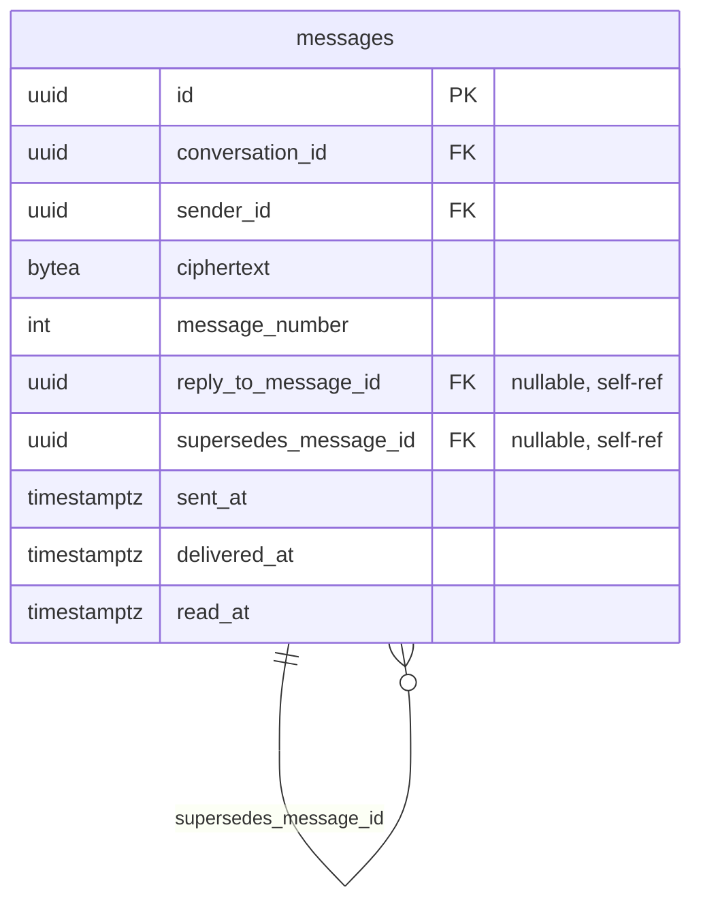
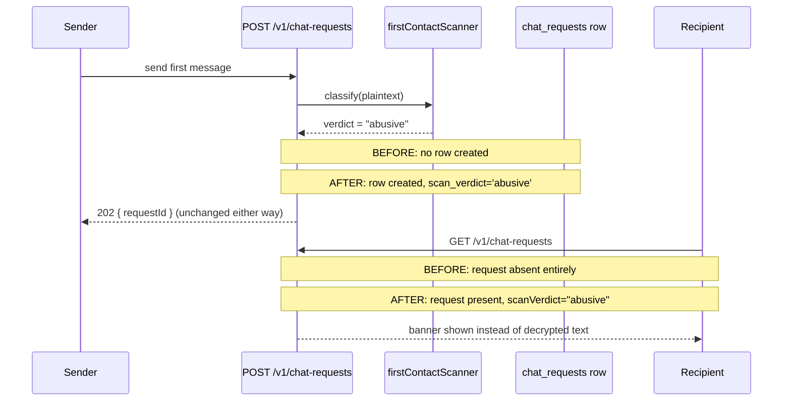
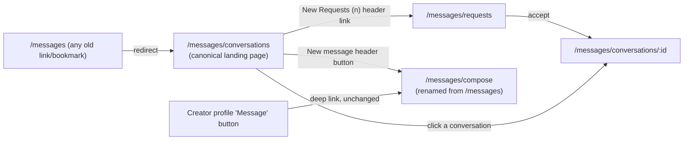

# feat: Messenger channel fixes

**Target repos:** `gatekept` (backend, Node/TypeScript/Express/Postgres/Redis/WS) and `distributed-video-moderation` (frontend, Next.js/React — this repo, checked out as `distributed-video-moderation-clone`). File paths below are repo-relative to whichever repo is named in each unit.

---

## Summary

Five fixes to the Gatekept messenger surface: (1) collapse the nav from three tabs to conversations-first with a single "New Requests" tab, (2) add per-message timestamps and day separators to the thread view, (3) add per-message action menus (Copy/Reply/Report on received, Edit/Reply/Copy on sent) including a new reply-reference column and a ratchet-safe edit model, (4) verify the existing duplicate-chat-request database gate and add the missing client-side "second message blocked" UX, (5) change abusive-first-message handling from a silent, traceless drop to a persisted, recipient-visible banner — while keeping the sender's response non-distinguishing.

---

## Problem Frame

The messenger ships with the request → accept → converse flow working end-to-end (confirmed in an earlier session; see `docs/changelog.md`), but the experience has rough edges the user has now spelled out precisely:

- The three-tab nav (New message / Requests / Conversations) buries the actual chat list behind an extra tab, and a fresh unread request has no obviously-dedicated inbox feel.
- Messages show no timestamp and no date context — a thread reads as an undifferentiated wall of bubbles regardless of how much real time passed between messages.
- There's no way to act on an individual message — no copy, no reply-with-context, no report-this-message, no edit.
- Duplicate-request prevention already exists server-side (`idx_chat_requests_one_pending` in `gatekept/backend/migrations/001_init.sql`) but the client gives no proactive feedback — a user can attempt a second send and only discover it was silently absorbed after the fact.
- An abusive first message is dropped so completely today that `gatekept/docs/gaps.md` itself flags this as a known gap ("Silent abuse-drops leave no row... no audit trail for pattern analysis against repeat abusive senders").

This plan resolves all five with concrete designs, including two decisions that needed real technical resolution rather than direct implementation:

- **Edit** cannot be a ciphertext UPDATE — Double Ratchet forward secrecy means the original message key no longer exists once the ratchet advances. Signal's own Edit Message feature (researched below) resolves this via *supersession*: a brand-new, independently-ratcheted message plus a `supersedes_message_id` reference, never a mutation. This plan adopts that model.
- **Item 5's banner** is a deliberate security-posture change the user explicitly approved after being shown the tradeoff: today an abusive-verdict message creates zero trace and the sender gets an identical-looking fake success (`chatRequestService.ts`'s oracle-denial cascade, design doc §6.1). Going forward, a row **is** created with `scan_verdict = 'abusive'`, and the **recipient** sees a banner instead of decrypted text. The **sender**-side response contract does not change — it must remain indistinguishable from a real send, preserving half of the existing oracle-denial guarantee while deliberately giving up the other half (recipient-side invisibility) in exchange for an audit trail and a safer recipient experience.

---

## Requirements

- **R1** — Opening the messenger lands the user directly on their conversations list. The only tab visible at the top of that list is "New Requests." The former "New message" (compose/search) and "Conversations" tabs are removed as top-level nav destinations.
- **R2** — The compose/search flow (currently `frontend/app/messages/page.tsx`, relocating to `frontend/app/messages/compose/page.tsx` per KTD2) remains reachable — it is not deleted — via its existing deep-link entry point from creator profiles, and via a new affordance reachable from the conversations list (since removing its tab must not remove the only way to start a new conversation).
- **R3** — Every message in a thread displays a timestamp. When adjacent messages cross a calendar-day boundary, a centered day-separator (date + day-of-week + clock-style icon) is inserted between them.
- **R4** — Received messages expose a Copy / Reply / Report action menu. Sent messages expose an Edit / Reply / Copy action menu. Each action performs a real operation, not a stub.
- **R5** — Reply tags the specific message being replied to; the composer shows a quoted reference, and the sent message persists which message it replied to.
- **R6** — Edit revises a previously sent message without breaking Double Ratchet forward secrecy — no in-place ciphertext mutation. Edited messages are visibly marked as edited.
- **R7** — Report on an individual message carries that message's ID as evidence, using the backend's existing `evidence.messageIds` support.
- **R8** — Duplicate chat channels per user pair remain impossible (already enforced server-side); the plan verifies this holds and adds a client-side affordance that disables/warns on a second send attempt before the first request is accepted.
- **R9** — A first message that scores `abusive` from the existing scanner persists a `chat_requests` row (`scan_verdict = 'abusive'`) instead of being silently dropped. The recipient's requests inbox shows a banner in place of the (undeliverable) decrypted content for that request, and accepting that specific request requires an extra confirmation step. The sender's `POST /v1/chat-requests` response is unchanged in shape and timing from a normal accepted send, and no push/email/WS notification fires for the abusive-verdict row (see KTD9).

---

## Scope Boundaries

**In scope:** all five numbered items above, across both repos, including the new DB migration, new WS/event wiring where needed, and the corresponding frontend UI.

**Out of scope / non-goals:**
- Multi-device sync (Gatekept has no linked-device model today; edit/reply designs below do not need to account for it, unlike Signal's own implementation).
- An ML-backed abuse classifier — the existing rules-based `abuseClassifier.ts` is unchanged; only what happens *after* a verdict of `abusive` changes.
- Prekey-pool-exhaustion rate limiting, Sybil correlation, or other items already tracked in `gatekept/docs/gaps.md` — unrelated to this request.
- Admin/moderation tooling for reviewing reported or abusive-flagged messages (a report is filed and a banner is shown; building an admin review queue is future work).
- Edit-of-edit UI beyond a simple "edited" marker with the latest content shown (no visible edit-history list, unlike Signal's UI) — see KTD5.

### Deferred to Follow-Up Work
- An "edit history" view (list of prior revisions) — the data model (KTD5) supports adding this later without migration changes, but no UI for it ships now.
- Hidden admin-only audit view over `scan_verdict = 'abusive'` rows, beyond what the recipient already sees — `gatekept/docs/gaps.md` mentions this as a "production build would likely want" item; this plan satisfies the underlying need (a persisted row exists now) without building separate admin tooling. **Constraint for that future work** (surfaced in doc review): any such tooling must resolve `evidence.messageIds` against the exact row referenced at report time, not through KTD5's supersession resolution — the original message row's ciphertext is deliberately never rewritten specifically so a report's evidence can't be laundered by a later edit. This plan's own report flow (R7/U3) already does this correctly by construction (it stores the reported row's own ID); a future admin viewer must preserve that property rather than re-deriving "current" thread content when displaying reported evidence.
- Extracting `frontend/lib/clipboard.ts` as a cross-cutting utility was considered; see KTD8 for why it's included in this plan rather than deferred.
- Retention/TTL policy for persisted `scan_verdict = 'abusive'` rows — this plan starts persisting rows that were previously dropped entirely with no expiry. If abusive-first-message volume proves high in practice, an archival/cleanup job may be needed later; not addressed now since no admin consumer of the audit trail exists yet either (see above).

---

## Key Technical Decisions

**KTD1 — Nav restructure: redirect, don't delete.**
`frontend/app/messages/page.tsx` (compose/search) stops being a top-level tab and stops being what `/messages` renders by default. `/messages` becomes a server-side redirect to `/messages/conversations` (which becomes the canonical landing URL, unchanged internally). The compose flow keeps its route (`/messages/compose`, renamed from `/messages` — see KTD2) reachable via its existing deep-link caller (`frontend/app/creators/[id]/page.tsx:132`) and a new "New message" affordance placed directly on the conversations list (e.g., a compose icon/button in the list header) so starting a new conversation doesn't disappear — R2 requires it stay reachable, just not as a tab.
*Rationale:* deleting the compose page would break the one confirmed deep-link call site and remove the only way to start a conversation with someone not already in a request/conversation. A redirect preserves bookmarks/back-button behavior for anyone who had `/messages` saved.

**KTD2 — Route rename for clarity.**
Rename the physical route backing the compose/search flow from `/messages` to `/messages/compose`, updating the one deep-link call site (`frontend/app/creators/[id]/page.tsx:132`) and the internal "back to requests" button (`frontend/app/messages/page.tsx:352`, which already free-floats and is unaffected in behavior, just in a new file location).
*Rationale:* once `/messages` itself always redirects to `/messages/conversations`, keeping the compose page's own route *at* `/messages` is confusing (two different pages both claiming the root path depending on request vs. redirect timing). A dedicated `/messages/compose` path removes the ambiguity. `MessagesNavTabs.tsx` is deleted outright (see KTD3) so this rename has no remaining tab-highlighting logic to update.

**KTD3 — Tabs collapse to a single "New Requests" affordance, not a literal one-item tab bar.**
`frontend/components/MessagesNavTabs.tsx` (currently a 3-item tab row rendered on 3 pages) is deleted. `frontend/app/messages/conversations/page.tsx` (the list — becomes the canonical `/messages/conversations` landing page) instead renders a single "New Requests" link/badge in its own header, showing the pending-request count when > 0, linking to `/messages/requests`. `frontend/app/messages/requests/page.tsx` gets a lightweight "back to conversations" link in its header — no directly reusable back-link JSX pattern exists elsewhere in the messenger surface today (confirmed: `conversations/[conversationId]/page.tsx:475` is a programmatic `router.push` inside a block-action handler, not rendered back-link JSX), so this is a small new element styled consistently with the app's general link/button conventions rather than a copy of an existing pattern.
*Rationale:* a literal single-item "tab bar" would look broken (a tab row with one entry reads as a bug, not a design). A count-bearing link in the conversations list header is the natural single-destination affordance and directly satisfies R1's "only a New Requests tab at the top" intent without the visual oddity of a one-tab `<nav>`.

**KTD4 — `nav-bar.tsx`'s badge-routing logic simplifies, not expands.**
`frontend/components/nav-bar.tsx`'s `NAV_ITEMS` entry for Messages **keeps `item.href` as the literal string `"/messages"`** — this is deliberate and must not be changed, because `item.href` is also compared by exact-string match in two other places in the same render: the badge-override href computation (`item.href === "/messages" && navDotVisible ? ...`) and the unread-dot's own visibility condition (`item.href === "/messages" && navDotVisible && (...)`). Changing `item.href` itself to `/messages/conversations` would silently break both of those exact-match checks (the dot would stop rendering entirely) as well as the `active` highlight's prefix check (`pathname.startsWith(item.href + "/")`), which currently correctly treats every `/messages/*` sub-route as "active" regardless of the literal href rendered. Instead, only the **computed link target's non-badge fallback branch** changes: `const href = item.href === "/messages" && navDotVisible ? "/messages/requests" : "/messages/conversations";` — i.e., replace the trailing `: item.href` with the literal `: "/messages/conversations"`, leaving every other reference to `item.href` (active-highlight, dot-visibility) untouched. `NAV_DOT_CLEARING_ROUTES` (currently `["/messages/requests", "/messages/conversations"]`) is unchanged — both routes already clear the dot correctly under the new structure.
*Rationale:* minimal-diff change that preserves the existing, already-correct "badge leads somewhere useful" behavior and the existing unread-dot rendering from the earlier hydration-bug fix, repointing only the non-badge navigation target from the old compose page to the new conversations landing page. (Caught in doc review: the naive edit of changing `item.href` itself — the literal reading of "base href becomes X" — breaks the dot and active-highlight as a silent regression; this KTD is written to foreclose that reading.)

**KTD5 — Edit is modeled as supersession, not mutation** *(resolves the Double Ratchet blocker; grounded in external research on Signal's own Edit Message design and Matrix's `m.replace`/`m.relates_to` pattern)*.
An edit is a **new row** in `messages` — freshly encrypted at the next ratchet step, normal send path, no special-casing in the crypto layer — carrying a new nullable column `supersedes_message_id UUID REFERENCES messages(id)`. The **original** message row is untouched (its ciphertext is never rewritten). Clients render the thread by: for any message that is the target of a `supersedes_message_id` reference, display the *superseding* message's content in the original's timeline position, with an "edited" marker; the original ciphertext is never re-decrypted for display once superseded. `supersedes_message_id` is validated (service layer, not just a bare FK) against the same `conversation_id` as the message it targets before being honored — this directly addresses GHSL-2026-082 (a real Signal-Android advisory on an *Admin Delete* feature that validated sender privilege but not that the target belonged to the same thread/conversation; Signal's own Edit Message handler is cited in that advisory as the correct pattern to imitate). Edit-of-edit points `supersedes_message_id` at the **original** message's ID (matching Signal's `targetSentTimestamp`-always-targets-original convention), not at the immediately-prior edit, so the thread only ever needs to resolve one level of "what supersedes this" per original message rather than walking a chain.

**Concurrent-edit tie-break (closes a race the client-only convention leaves open):** the server does not reject a second edit targeting an already-superseded original (the sender's own client may retry after a timeout, or a legitimately concurrent edit from two open sessions may both fire) — the FK and the conversation-scoping check both allow it structurally, since "at most one live supersession per original" is not a constraint the schema enforces. To keep every client resolving to the *same* "current" content deterministically, resolution uses a single documented tie-break rule applied identically everywhere a `supersedes_message_id` map is built (client thread rendering, any future server-side preview/notification text): **latest `sent_at` wins; ties (identical `sent_at`) broken by higher `id`.** This is a rendering-resolution rule, not a database constraint — no migration change needed, just a specified, consistently-applied comparator.
*Rationale:* this is the only model that survives forward secrecy — the alternative (storing an `edited_ciphertext` sibling column, considered and rejected) would require the *original* recipient's ratchet state to still be able to decrypt something claiming to belong to the original `message_number`, which PFS explicitly makes impossible once the ratchet has advanced. Supersession sidesteps this because the edit is a wholly ordinary new message from the ratchet's point of view. The tie-break rule closes a gap doc review surfaced: without one, two clients resolving "the current edit" independently (e.g. one still holding a stale in-memory list) could disagree about which edit is authoritative, producing inconsistent thread state across viewers of the same conversation.

**KTD6 — Reply is a plaintext-adjacent reference column, mirroring KTD5's shape.**
`messages` gains `reply_to_message_id UUID REFERENCES messages(id) NULL`, populated at send time by the client (readable metadata, like `supersedes_message_id` — the server never needs to decrypt to know a message is a reply, only to know *which* message it replies to). Same conversation-scoping validation as KTD5's `supersedes_message_id` applies. The client renders the referenced message as a compact quoted preview above the reply bubble; if the referenced message isn't present client-side (deleted, or a data gap), the UI falls back to a muted "original message unavailable" placeholder rather than erroring (matches the documented real-world Signal-Desktop rough edge for this exact case, treated here as an expected state to design for, not an edge case to ignore).

**Quoted-preview resolution when the replied-to message is later edited:** quoted previews resolve `reply_to_message_id` **through supersession** — i.e., a quoted preview always shows the referenced message's *current* (possibly edited) content, using the same resolution map and tie-break rule as KTD5's bubble rendering, not the content as it existed at the moment the reply was sent. This is a deliberate choice among two defensible options (the alternative — pinning the quote to the exact wording at reply-time, matching Signal's own UI — was considered and rejected here): showing current content keeps a reply's quote consistent with what a reader sees if they scroll to the original message's position, and avoids a subtler problem specific to this app's abuse-prevention purpose — pinning quotes to pre-edit wording would let a sender's original abusive wording persist indefinitely inside every reply that quoted it, even after the sender edits the original away, which is inconsistent with treating "edited" as the message's authoritative current state everywhere else in this plan. This does **not** weaken reporting: `evidence.messageIds` (R7) resolves against the exact row referenced at report time, not through supersession (the original ciphertext is preserved specifically to support this — see Scope Boundaries), so a reporter's evidence is unaffected by a later edit even though the live thread's quotes are.
*Rationale:* same reasoning as KTD5 — no crypto blocker exists for reply (unlike edit) since a reply is inherently a brand-new, independently-ratcheted message; the only design question was where "replies to X" lives, and mirroring the edit column's shape keeps both features structurally consistent and reviewable together in one migration. The quoted-preview resolution rule closes a gap doc review surfaced: the plan had resolved "what does an edited message's own bubble show" but not "what does a reply's quote of that message show," and the two candidate answers produce meaningfully different UX (and, per the abuse-prevention angle above, meaningfully different resistance to a sender using Edit to launder earlier abusive wording out of the visible thread).

**KTD7 — Both new columns ship in one migration, `005_message_references.sql`.**
Following the existing `gatekept/backend/migrations/001-004` convention (up-only, heavily-commented header explaining rationale and rejected alternatives, zero-padded 3-digit numbering): `005_message_references.sql` adds `reply_to_message_id` and `supersedes_message_id` (both nullable FKs to `messages(id)`, both `ON DELETE SET NULL` so a hard-deleted message doesn't cascade-orphan reference integrity) plus supporting indexes for the "does this message have a reply/edit" lookup pattern the thread view needs.
*Rationale:* both columns are additive, nullable, same shape, same validation rule (conversation-scoping) — shipping them together is one coherent migration rather than two near-identical ones.

**KTD8 — New shared UI primitives: action menu + clipboard helper.**
No dropdown/menu component exists anywhere in this frontend (confirmed — no Radix dropdown, no shadcn/ui per this repo's own removed-shadcn convention). A new `frontend/components/MessageActionMenu.tsx` is built from scratch, inline-styled per this codebase's CSS-variable convention (`var(--surface)`, `var(--border)`, `var(--fg)`, `var(--accent)`), following the existing small-single-purpose-component pattern (`MessageToast.tsx`, `AttachmentPicker.tsx`). A small `frontend/lib/clipboard.ts` helper is extracted for the Copy action, since it will now have two call sites (the existing `feed/page.tsx` share-link copy, and the new message-copy action) — the existing inline `handleShare` in `feed/page.tsx` is *not* refactored to use it (out of scope; only the new call site uses the new helper, avoiding a drive-by change to unrelated, working code).
*Rationale:* building vs. adopting a library was considered; given no dropdown primitive exists anywhere and Radix isn't already a dependency, adding a new external dependency for one menu component is disproportionate — a ~40-60 line custom component matches existing codebase conventions better than introducing a new UI library.

**KTD9 — Abusive-verdict row persists; sender response contract is byte-for-byte unchanged; only recipient-side display changes.**
`gatekept/backend/src/services/chatRequestService.ts`'s `sendChatRequest` early-return for `verdict === "abusive"` (currently: no `createChatRequest` call, fake success returned) changes to: call `createChatRequest` for real with `scan_verdict: "abusive"` (the column and CHECK constraint already exist in `001_init.sql`; the abusive value has just never been written), then return the **exact same response shape and status code** (`202 { requestId }`) as every other path — including the clean-delivered path — so the sender-side response remains non-distinguishing. The **only** thing that changes end-to-end is that a real row now exists and the **recipient's** `GET /v1/chat-requests` response (`gatekept/backend/src/routes/chatRequests.ts` lines 62-80) gains a `scanVerdict` field in its mapping (confirmed via direct route read: the underlying `listPendingRequests` DB query already selects `scan_verdict`; only the route's response-object mapper was omitting it). The frontend's requests-list page (`frontend/app/messages/requests/page.tsx`) conditionally renders a banner component in place of `placeholderDecrypt(req.ciphertext)` (currently line 203) when `scanVerdict === "abusive"`, and does **not** attempt to decrypt/display the underlying ciphertext at all in that case.

**Notification fan-out is explicitly suppressed for abusive-verdict rows (this is NOT full path reuse).** The existing security-labeled test in `chatRequestService.test.ts` ("an abusive scan verdict's `sendChatRequest` call produces zero email-send AND zero publish calls") continues to hold: `notifyNewChatRequest` and `realtimeFanout.publishChatRequest` are **not** called on the abusive-verdict branch, even though a row now persists. Only the row-creation and response-construction logic is unified with the clean path; the two fire-and-forget notification calls stay conditional on `verdict !== "abusive"`. The recipient learns about a flagged request only by later polling/opening `GET /v1/chat-requests` (which now includes it), not via push/email/WS badge — deliberately, so a repeat abusive sender can't use notification delivery (or its absence) as a second, out-of-band oracle, and so the existing test's documented security property survives unmodified rather than needing to be rewritten to expect different behavior.

**Explicit ordering: duplicate-check runs before the abuse classifier.** The existing pending-duplicate check (`idx_chat_requests_one_pending` / its `ConflictError` catch) executes **before** `firstContactScanner.classify()` is invoked, not after. Rationale for this specific order (not left to implementation discovery): (a) it's cheap — an index lookup/conflict versus a regex-based classification pass — so rejecting an already-duplicate send avoids running the more expensive classifier on a request that's going to be rejected either way; (b) it bounds the timing-oracle surface named below, since the classifier (whose internal cost may vary by verdict — a harassment-pattern short-circuit versus a full multi-category scan) only ever runs on requests that pass the cheap duplicate check first, making its variable cost the same across every request that reaches it regardless of eventual verdict, rather than an additional variable stacked unpredictably after a second variable-cost step. A sender's second message to a recipient with an unresolved (including abusive-verdict) pending request now correctly hits this real duplicate path and returns the same non-distinguishing shape as any other duplicate — this is desired: it genuinely is a duplicate pending request once the row persists.

**Timing, not just body shape, must be verified non-distinguishing (gap surfaced in doc review).** The full-response-body-comparison test (see U2) proves shape parity but not latency parity. Because `classify()`'s cost may vary by input even at the same verdict tier, and because the abusive path now performs one additional `INSERT ... RETURNING *` it didn't before, U2 must include a check (documented, not necessarily a strict automated timing assertion given real-world test-environment jitter) that the abusive and clean-delivered paths perform the same *shape* of work in the same order — one classify call, one insert, one response construction — so no path takes a structurally different number of steps an attacker could distinguish by timing even if this plan doesn't commit to a hard millisecond budget.

**Accept requires explicit confirmation when `scan_verdict = 'abusive'` (closes a gap the banner alone doesn't cover).** The banner (KTD9's recipient-display change) only suppresses the *content preview* — it does not, by itself, add friction to the Accept action, and `acceptChatRequest` has no verdict-aware gate today. Without an explicit decision here, a recipient could one-tap Accept into a live conversation with a flagged-abusive sender exactly as easily as any normal request, which undercuts the purpose of surfacing the verdict at all. This plan adds one: when the request being accepted has `scan_verdict = 'abusive'`, the frontend's Accept action requires an extra confirmation step (e.g., "This message was flagged as potentially abusive. Accept anyway?") before calling `POST /v1/chat-requests/:id/accept`; Reject and Block remain one-tap as today. This is a client-side UX gate, not a new server-side restriction — the recipient retains full agency to accept if they choose to (e.g., a false positive on reclaimed language or an ordinary word pattern), consistent with this plan not adding an ML classifier or otherwise changing the underlying verdict's reliability.

**Deploy-ordering constraint: frontend banner code must ship no later than backend row-persistence.** Because `createChatRequest` now stores the message's real ciphertext for an abusive-verdict row (identical to every other row — only the *display* logic differs), a frontend build that predates U7's banner conditional would call `placeholderDecrypt(req.ciphertext)` on a real, previously-would-have-been-dropped abusive message and display it unfiltered — the opposite of this feature's purpose, and worse than doing nothing. U2 (backend row-persistence) and U7 (frontend banner) must be deployed together or with U7 first; U7 must not lag U2 in production. This is called out explicitly here (rather than left implicit in Risks & Dependencies) because the failure mode actively works against the safety property being added, not merely a testing inconvenience.

*Rationale:* this is the user-approved, deliberate half-change to the oracle-denial posture: sender-side non-distinguishability (the actual anti-enumeration property — a bad actor probing "did my abusive message get through" via the API response must not learn anything) is fully preserved at the protocol/response level; recipient-side invisibility (the property that made rows simply not exist) is deliberately given up in exchange for a real audit trail and a safer recipient experience, matching what `gatekept/docs/gaps.md` itself flagged as a desired improvement. This does not claim protection against a recipient voluntarily disclosing out-of-band that they saw a flagged-content banner (a social/behavioral channel outside this plan's scope) — only against automated/protocol-level enumeration via the API itself.

**KTD10 — Duplicate-channel prevention: verify, do not rebuild.**
`idx_chat_requests_one_pending` (partial unique index on `(sender_id, recipient_id) WHERE status = 'pending'`) already fully enforces "one pending request per ordered pair" at the database layer, and `chatRequestService.ts` already catches the resulting `ConflictError` and maps it to the same fake-success shape as every other silent path. This plan adds no new server-side enforcement. The net-new work is client-side only: the compose flow (`frontend/app/messages/page.tsx`, moving to `/messages/compose` per KTD2) tracks whether a pending outbound request to the current recipient already exists (via a lightweight existence check — reusing whatever the page already fetches, or a new cheap existence query if none exists today) and disables the send button with an inline warning ("You already have a pending request with this person") rather than allowing a submit that the server would silently absorb. This is a UX improvement layered on an already-correct backend, not a new security boundary.
*Rationale:* explicitly required by the plan's input constraints — confirm and do not weaken the existing oracle-denial-preserving mechanism. The fix here is purely about not leaving the sender guessing.

---

## High-Level Technical Design

### Message reference model (KTD5 + KTD6)



Both reference columns are same-shape, same-validation (conversation-scoped), same-migration (KTD7). The distinction is purely in client rendering: a `reply_to_message_id` reference is displayed *alongside* its own bubble (quoted preview); a `supersedes_message_id` reference *replaces* the original's displayed content at the original's timeline position.

### Abusive-message flow, before and after (KTD9)



### Nav restructure (KTD1-KTD4)



---

## Output Structure

No new top-level directories are created. New files land in existing directories:

```
gatekept/backend/migrations/
  └── 005_message_references.sql              (new)

gatekept/backend/src/
  ├── db/
  │   ├── messages.ts                           (modified — reply/supersede queries)
  │   ├── messages.test.ts                       (modified)
  │   └── chatRequests.ts                        (modified — none needed, already selects scan_verdict)
  ├── routes/
  │   ├── chatRequests.ts                        (modified — include scanVerdict in response)
  │   └── reports.ts                              (unchanged — already accepts evidence.messageIds)
  └── services/
      ├── messagingService.ts                   (modified — reply/edit send paths)
      ├── messagingService.test.ts               (modified)
      ├── chatRequestService.ts                  (modified — persist abusive-verdict rows)
      └── chatRequestService.test.ts              (modified)

frontend/
  ├── app/
  │   ├── creators/[id]/page.tsx                 (modified — deep-link target updates to /messages/compose)
  │   └── messages/
  │       ├── conversations/page.tsx                (modified — becomes canonical landing, header w/ New Requests + New message)
  │       ├── conversations/[conversationId]/page.tsx (modified — timestamps, day separators, action menu, reply/edit UI)
  │       ├── requests/page.tsx                      (modified — banner rendering, back-link, accept-confirmation)
  │       └── compose/page.tsx                       (new — moved from app/messages/page.tsx)
  ├── app/messages/page.tsx                      (replaced — becomes a redirect to /messages/conversations)
  ├── components/
  │   ├── MessagesNavTabs.tsx                    (deleted)
  │   ├── MessageActionMenu.tsx                  (new)
  │   ├── DaySeparator.tsx                       (new)
  │   └── OffensiveBanner.tsx                    (new)
  ├── components/nav-bar.tsx                     (modified — href logic per KTD4)
  └── lib/
      ├── gatekept-api.ts                        (modified — new types/fields)
      ├── clipboard.ts                           (new)
      ├── clipboard.test.ts                       (new)
      ├── messageDayGroups.ts                    (new — day-separator grouping helper)
      └── messageDayGroups.test.ts                (new)
```

---

## Implementation Units

### U1. Backend: message reference migration + query layer

**Goal:** Add the `reply_to_message_id` and `supersedes_message_id` columns and the query-layer support both reply and edit need.

**Requirements:** R5, R6 (see KTD5, KTD6, KTD7)

**Dependencies:** none

**Files:**
- `gatekept/backend/migrations/005_message_references.sql` (new)
- `gatekept/backend/src/db/messages.ts` (modify)
- `gatekept/backend/src/db/messages.test.ts` (modify/extend)

**Approach:**
- New migration, following the `001`-`004` header-comment convention: explain why both columns are nullable self-referencing FKs with `ON DELETE SET NULL`, why supersession targets the *original* message id always (not chain-of-edits), and cross-reference this plan doc.
- Add indexes supporting "fetch a conversation's messages with their reply/supersession targets resolved in one query" (avoid N+1 lookups in the thread view) — e.g. an index on `supersedes_message_id` and `reply_to_message_id` where non-null.
- `db/messages.ts` gains: a way to insert a message with an optional `replyToMessageId` and/or `supersedesMessageId`; a **service-layer validation helper** (not just relying on the FK) that both reference columns must point at a message in the **same `conversation_id`** as the new message being inserted — reject otherwise. This is the direct mitigation for the GHSL-2026-082-style cross-conversation targeting pitfall surfaced in research.
- Fetch queries (`listMessages` or equivalent) resolve both reference columns so the API layer doesn't need a second round-trip per message.

**Patterns to follow:** `gatekept/backend/migrations/004_message_read_status.sql`'s header-comment style and its "application-layer invariant, not a DB constraint" note (for the conversation-scoping check, which can't be expressed as a CHECK constraint since it requires a self-join).

**Test scenarios:**
- Happy path: insert a message with `replyToMessageId` pointing at an earlier message in the same conversation → succeeds, fetch returns the reference resolved.
- Happy path: insert a message with `supersedesMessageId` pointing at an earlier message in the same conversation → succeeds.
- Edge case: `replyToMessageId`/`supersedesMessageId` pointing at a message in a **different** conversation → rejected at the service/query layer (not just relying on the FK, which would not catch this).
- Edge case: `supersedesMessageId` pointing at a message that is itself already a supersession target of another edit → allowed to be superseded again structurally, but the unit should confirm the plan's "always target original" convention is enforced by the client, not assumed unenforceable server-side garbage-in (server accepts what it's given; document this boundary in a code comment rather than adding enforcement the plan doesn't call for).
- Edge case: referenced message ID does not exist at all → FK violation surfaces as a clean rejection, not a silent no-op.
- Integration: fetching a conversation's message list returns reply/supersession references resolved (not just raw UUIDs) so the frontend doesn't need a second query per message.

**Verification:** Migration applies cleanly to a fresh database; `db/messages.test.ts` passes; existing message-insertion tests (no reply/supersede) continue to pass unmodified, confirming the new columns are additive and don't disturb the existing send path.

---

### U2. Backend: Edit and Reply send paths + abusive-verdict persistence

**Goal:** Wire the new reference columns into the actual message-send service, and change `chatRequestService.ts`'s abusive-verdict handling to persist a row.

**Requirements:** R5, R6, R9 (see KTD5, KTD6, KTD9)

**Dependencies:** U1

**Files:**
- `gatekept/backend/src/services/messagingService.ts` (modify)
- `gatekept/backend/src/services/messagingService.test.ts` (modify/extend)
- `gatekept/backend/src/services/chatRequestService.ts` (modify)
- `gatekept/backend/src/services/chatRequestService.test.ts` (modify/extend)
- `gatekept/backend/src/routes/chatRequests.ts` (modify — include `scanVerdict` in GET response)

**Approach:**
- `messagingService.ts`'s send path accepts optional `replyToMessageId`/`supersedesMessageId`, passes them through to `db/messages.ts` from U1, and applies the same conversation-scoping validation at the service boundary (defense in depth — validate at both layers per the GHSL-2026-082 lesson).
- No new crypto logic — an edit and a reply are both, from the ratchet's perspective, completely ordinary new messages. The only service-layer addition is threading the two optional reference fields through.
- `chatRequestService.ts`'s `sendChatRequest`: the duplicate-pending check runs **before** `firstContactScanner.classify()` (per KTD9's explicit ordering decision — do not reorder). The `verdict === "abusive"` branch (currently an early return with a fake-success response and no `createChatRequest` call) is changed to call `createChatRequest` with `scanVerdict: "abusive"` set, then build the response using the **same** response-construction code as the clean-delivered case — not a parallel response construction, to structurally guarantee the shape can't drift from the non-abusive path. This response-path unification covers row-creation and response-shape only; it explicitly does **not** extend to the two fire-and-forget notification calls (`notifyNewChatRequest`, `realtimeFanout.publishChatRequest`), which stay gated on `verdict !== "abusive"` exactly as today (KTD9) — the existing security-labeled test asserting zero notify/publish calls for the abusive path must continue passing, not be rewritten to expect calls.
- `routes/chatRequests.ts`'s `GET /` handler mapping (lines 69-77) gains a `scanVerdict: r.scan_verdict` field. This is additive only — no existing field is removed or renamed.

**Patterns to follow:** the existing oracle-denial code comments in `chatRequestService.ts` (the ones explicitly warning "this MUST NOT surface as a distinguishable response") — extend that same commenting discipline to the changed branch so a future reader understands why the row now persists but the response still doesn't change, and why notification fan-out stays suppressed even though row-creation and response construction do not.

**Test scenarios:**
- Happy path: send a message with `replyToMessageId` set → persisted, retrievable with the reference resolved.
- Happy path: send a message with `supersedesMessageId` set → persisted; original message's own row/ciphertext is unchanged (explicit assertion the original wasn't mutated).
- Edge case: reply/supersede target in a different conversation → rejected with the same error shape as a not-found target (don't leak "this ID exists but in the wrong conversation" as a distinguishable error).
- Happy path: first message scores `abusive` → a `chat_requests` row now exists with `scan_verdict = 'abusive'`, and the sender's `POST` response is byte-for-byte identical in shape/status to a clean-delivered send (this is the core regression test for KTD9 — compare full response bodies, not just status codes).
- Regression (must continue passing, not be modified to expect new behavior): the existing "abusive scan verdict produces zero email-send AND zero publish calls" test in `chatRequestService.test.ts` still passes — row persistence must not cause notification fan-out to fire.
- Integration: sender sends an abusive first message, then attempts a second message to the same recipient before the first is resolved → the second attempt is caught by the duplicate-pending check (per the now-explicit ordering) and returns the same non-distinguishing shape, and confirms no second row is created.
- Regression: existing oracle-denial test suite (banned sender, blocked recipient, clean send, duplicate-pending) still passes unmodified — proves the response-shape guarantee holds across all branches, not just the changed one.
- Happy path: `GET /v1/chat-requests` response for a recipient with one abusive-verdict pending request includes `scanVerdict: "abusive"`; a clean pending request in the same response has `scanVerdict: "clean"` (or `null`/`"uncertain"` per whatever the scanner actually returned) — confirms the field is present and correctly per-row, not a global flag.
- Documented (not necessarily strict-automated, given test-environment timing jitter): the abusive and clean-delivered paths perform the same *shape* of work in the same order (one classify call, one insert, one response construction) — a code-level assertion or comment confirming no structurally different step count between the two paths, addressing the timing-parity concern KTD9 names alongside the body-shape guarantee.

**Verification:** Full existing chat-request and messaging test suites pass; new tests above pass; manual confirmation (documented, not automated) that a sender never sees any difference in the send response between an abusive and clean first message, and that no notification fires for the abusive-verdict case.

---

### U3. Backend: Report evidence + duplicate-request verification

**Goal:** Confirm the duplicate-request gate is intact end-to-end, and extend report evidence to carry a message ID (backend side — the type already accepts it).

**Requirements:** R7, R8 (see KTD10)

**Dependencies:** none (independent of U1/U2)

**Files:**
- `gatekept/backend/src/routes/reports.ts` (verify only — likely no change needed)
- `gatekept/backend/src/services/chatRequestService.test.ts` (extend — explicit duplicate-index regression test if one doesn't already directly exercise it)

**Approach:**
- This is primarily a **verification** unit, not new backend code — `idx_chat_requests_one_pending` and its `ConflictError` handling already exist and already work per the existing test suite and prior research confirmation. Read through the current test coverage for this index; if no test directly proves "second pending request to the same recipient is silently absorbed, not created as a second row," add one.
- Confirm `reports.ts`'s existing `evidence.messageIds` zod field works against a real message report submission end-to-end (it was previously confirmed present in the schema but its end-to-end path with a real message ID wasn't traced) — this may reveal it already works with no changes needed.
- **Explicit decision (closes a gap doc review surfaced — do not leave to implementation-time judgment):** `evidence.messageIds` gets the **same conversation/chat-request-scoping validation** as `reply_to_message_id`/`supersedes_message_id` in U1 — a reporter may only cite message IDs that actually belong to the `chatRequestId`/`conversationId` they're reporting, rejected otherwise. This is a small addition to `reportService.ts`'s `fileReport`, not a no-op verification: today it accepts any UUID with no ownership check. Applying the same discipline here avoids building future admin/moderation tooling (deferred, see Scope Boundaries) on top of an evidence field that was never actually trustworthy, and keeps this plan's "reference IDs crossing a trust boundary get scoped" rule uniform rather than carrying one deliberate exception.

**Patterns to follow:** existing `idx_chat_requests_one_pending`-adjacent tests in `chatRequestService.test.ts`; the conversation-scoping validation helper introduced in U1 for `reply_to_message_id`/`supersedes_message_id` (reuse or mirror its shape for `evidence.messageIds`' chat-request/conversation scoping).

**Test scenarios:**
- Happy path: report a chat request with `evidence.messageIds` containing one real message ID from that conversation → persists correctly, retrievable.
- Edge case: `evidence.messageIds` containing an ID from a different conversation than the one being reported → rejected (per the explicit scoping decision above), not silently accepted.
- Regression: sending two chat requests to the same pending recipient still results in exactly one `chat_requests` row and the second attempt returns the same non-distinguishing response as every other silent-fail path.

**Verification:** Existing + new tests pass; this unit's findings (verification-only vs. needing a fix) are documented in the PR description either way.

---

### U4. Frontend: nav restructure — conversations-first landing, single New Requests affordance

**Goal:** Implement KTD1-KTD4 — remove the three-tab bar, make `/messages/conversations` the canonical landing page, rename the compose route, and update nav-bar routing.

**Requirements:** R1, R2 (see KTD1, KTD2, KTD3, KTD4)

**Dependencies:** none (pure frontend, independent of backend units)

**Files:**
- `frontend/app/messages/page.tsx` (replace with redirect)
- `frontend/app/messages/compose/page.tsx` (new — moved content from the old `app/messages/page.tsx`)
- `frontend/app/messages/conversations/page.tsx` (modify — becomes canonical landing, gains header with New Requests link + New message button)
- `frontend/app/messages/requests/page.tsx` (modify — swap `MessagesNavTabs` for a simple back-link)
- `frontend/components/MessagesNavTabs.tsx` (delete)
- `frontend/components/nav-bar.tsx` (modify — href logic)
- `frontend/app/creators/[id]/page.tsx` (modify — update deep-link target from `/messages` to `/messages/compose`)

**Approach:**
- Move the existing compose/search page component body from `app/messages/page.tsx` to `app/messages/compose/page.tsx` unchanged (a file relocation, not a rewrite) — its internal logic (`Step = "idle" | "found" | "sent"`, deep-link query param handling) is untouched.
- Replace `app/messages/page.tsx` with a minimal redirect (Next.js `redirect()` to `/messages/conversations`).
- `app/messages/conversations/page.tsx` gains a header row: "New Requests" link (with count badge if the page already fetches or can cheaply fetch a pending count) on one side, a "New message" icon/button linking to `/messages/compose` on the other. Remove its `<MessagesNavTabs />` render.
- `app/messages/requests/page.tsx` removes `<MessagesNavTabs />`, adds a simple "← Conversations" back-link in its header, styled consistently with the existing back-link pattern already used inside `conversations/[conversationId]/page.tsx:475`.
- `nav-bar.tsx`: change the Messages `NAV_ITEMS` entry's base href from `/messages` to `/messages/conversations`; keep the `navDotVisible` override redirecting to `/messages/requests` unchanged.
- `creators/[id]/page.tsx:132`: update the `router.push` target from `/messages?to=...` to `/messages/compose?to=...`.

**Patterns to follow:** the existing back-link styling in `conversations/[conversationId]/page.tsx` (lines around 475/494); the existing CSS-variable theming convention throughout `frontend/components/`.

**Test scenarios:**
- Happy path: navigating to `/messages` redirects to `/messages/conversations`.
- Happy path: `/messages/conversations` renders with a "New Requests" link and a "New message" affordance, no three-tab bar.
- Happy path: clicking "New Requests" navigates to `/messages/requests`, which shows a "back to conversations" link (not the old tab bar).
- Happy path: clicking "New message" navigates to `/messages/compose` and the compose/search flow works unchanged (search, select, first-message send).
- Happy path: the creator profile "Message" button still correctly deep-links into compose with `to`/`name`/`type` query params intact, now at the new path.
- Regression: nav-bar's Messages icon, when a badge is pending, still routes to `/messages/requests`; when no badge, routes to `/messages/conversations` (not the old default of `/messages` compose).
- Edge case: a bookmarked/old `/messages?to=<id>` URL (pre-rename) — document expected behavior (this will now hit the redirect-to-conversations page and lose the `to` param, since the redirect target doesn't forward query params); acceptable per scope, but the test should assert the actual behavior so it's not an accidental regression discovered later.

**Verification:** Manual click-through of the full nav flow (conversations → requests → back; conversations → compose → send → lands in new conversation) in addition to automated route/component tests; `npx tsc --noEmit`, lint, and existing test suite all remain clean.

---

### U5. Frontend: message timestamps + day separators

**Goal:** Implement R3 — render `sentAt` under each message and insert day separators at date boundaries.

**Requirements:** R3

**Dependencies:** none (independent of other frontend units, though it touches the same thread-view file as U6/U7 — see sequencing note)

**Files:**
- `frontend/app/messages/conversations/[conversationId]/page.tsx` (modify — render loop restructure)
- `frontend/lib/messageDayGroups.ts` (new)
- `frontend/lib/messageDayGroups.test.ts` (new)
- `frontend/components/DaySeparator.tsx` (new)

**Approach:**
- Extract a pure helper `groupMessagesByDay(messages: MessageSummary[]): Array<{ type: "separator", date: Date } | { type: "message", message: MessageSummary }>` in `lib/messageDayGroups.ts` — takes the existing flat message array and returns an interleaved array the render loop can `.map()` directly, replacing the current plain `.map()` (per research: today's loop has no day-grouping and would need to switch from one-node-per-message to this flatMap-like interleaved shape).
- `DaySeparator.tsx`: small centered component — date + day-of-week (e.g. "Wednesday, September 18") + a clock/time icon, styled with the existing `var(--fg-muted)`/`var(--border)` tokens, horizontal rule on either side. Carries `role="separator"` with an `aria-label` matching the visible date text, so it announces distinctly from surrounding message content to assistive tech, following this codebase's existing `aria-label` convention (`MessageStatusTicks.tsx`'s per-state labels, the requests list's `aria-label="Unread"` dot).
- Under each message bubble (mine or theirs), render `sentAt` formatted as a local time string (e.g. "3:42 PM"), reusing/adjacent to the existing status-ticks row placement established in the seamless-chat plan (`MessageStatusTicks`) so the two don't visually collide — likely the same row, timestamp before or after the ticks.
- Day boundary comparison uses the viewer's local timezone (via `Date` methods), not UTC calendar days, so "new day" matches what the user actually perceives.

**Patterns to follow:** the existing "mine" vs "theirs" bubble row structure documented in prior research (outer `flex-direction: column` wrapper per message, ticks row below for "mine"); `MessageStatusTicks.tsx`'s existing placement/styling as the sibling element the timestamp sits next to.

**Test scenarios:**
- Happy path: `groupMessagesByDay` on messages all sent the same day → one contiguous message list, zero separators.
- Happy path: `groupMessagesByDay` on messages spanning two calendar days → exactly one separator inserted at the correct boundary.
- Edge case: messages spanning three or more days (including a gap day with zero messages) → separators only appear between days that actually have messages, not for empty gap days.
- Edge case: empty message list → returns empty array, no separator.
- Edge case: single message → no separator, just the message.
- Edge case: two messages sent at exactly 23:59:59 and 00:00:01 local time, one second apart, crossing midnight → separator still correctly inserted (proves the grouping is calendar-day-based, not duration-based).
- Integration: the conversation thread page renders the separator visually between the correct messages when fed a real day-spanning message list (component-level test or visual confirmation, documented if only manually verified).

**Verification:** `messageDayGroups.test.ts` passes; manual thread view shows timestamps under every message and a correctly-placed day separator when scrolling through a multi-day conversation.

---

### U6. Frontend: message action menu (Copy / Reply / Report / Edit)

**Goal:** Implement R4, R5 (client half), R7 (client half) — the per-message dropdown and its wired actions.

**Requirements:** R4, R5, R7

**Dependencies:** U2 (reply send path must exist server-side before the client can wire "send a reply"), U5 (shares the same render-loop restructure in the thread page — sequencing this after U5 avoids two units independently restructuring the same `.map()`)

**Files:**
- `frontend/components/MessageActionMenu.tsx` (new)
- `frontend/app/messages/conversations/[conversationId]/page.tsx` (modify — render menu per bubble, wire actions, reply-composer state)
- `frontend/lib/clipboard.ts` (new)
- `frontend/lib/clipboard.test.ts` (new)
- `frontend/lib/gatekept-api.ts` (modify — `fileReport()` gains `evidence.messageIds`; `MessageSummary` gains `replyToMessageId`/`supersedesMessageId` fields; new/updated send-message call accepts the same two optional fields)

**Approach:**
- `MessageActionMenu.tsx`: a small inline-styled popover/menu (built from scratch per KTD8, no new dependency), triggered by an **always-rendered** (not hover-gated) "..." button on every bubble, sized to at least a 44×44px effective hit area even though the visible icon is smaller — a hover-only trigger has no equivalent on touch devices, and this codebase has no established touch-fallback pattern to lean on, so the trigger must work identically on desktop and touch from the start. Rendering either `["Copy", "Reply", "Report"]` (received) or `["Edit", "Reply", "Copy"]` (sent), passed in as props so the same component serves both message directions. Supports dismiss-on-outside-click and Escape-to-close; positions itself to avoid overflowing the viewport edge (flip above/below or left/right of the trigger as needed, mirroring how `MessageToast.tsx` already handles fixed positioning in this codebase).
- Copy: calls the new `lib/clipboard.ts` helper with the *decrypted plaintext* of that message (not the ciphertext) — copies exactly what's visually rendered.
- Reply: sets local composer state (`replyingTo: MessageSummary | null`); composer UI shows a quoted-preview strip above the input referencing that message, dismissible; on send, the new `sendMessage` call passes `replyToMessageId`. Rendered replies show the quoted original above the reply bubble (resolved *through* supersession per KTD6's quoted-preview rule — i.e., showing the referenced message's current content, not its wording at reply-time) or the "original message unavailable" fallback if the referenced message isn't in the currently-loaded page of history.
- Report: calls `fileReport()` with `evidence.messageIds: [message.id]`. **Explicit decision (closes a gap doc review surfaced):** the existing report affordances in this codebase (`requests/page.tsx`'s "Report & block" and the thread page's own report action) both unconditionally call `blockUser` alongside `fileReport` — reusing that exact pattern for a per-message Report would mean reporting one message in an otherwise-fine conversation also ends the conversation entirely. Per-message Report is **not** coupled to block: it calls `fileReport()` only, with its own lighter-weight confirmation copy (e.g., "Report this message" rather than "Report & block"), distinct from the existing always-blocks affordances so users don't assume the same consequence. The existing request-level and conversation-level "Report & block" buttons are unchanged by this unit.
- Edit (sent messages only): clicking Edit opens the **composer**, pre-filled with the original message's plaintext, in an explicit "editing message X" mode (a labeled banner above the input showing what's being edited, with a visible Cancel that restores the composer to empty/its prior draft). This is chosen over an inline-editable bubble because the existing bubble layout (`maxWidth: 75%` flex sizing) wasn't designed to host an editable input plus save/cancel controls, while the composer already owns full-width input handling. **If the composer has in-progress unsent text when Edit is clicked on a message, that text is not silently discarded** — the edit-mode banner supersedes the draft in the input area, and canceling the edit restores the prior draft rather than leaving it lost. On save, calls `sendMessage` with `supersedesMessageId` set to the original message's ID, then exits edit mode. The thread view resolves superseded messages per KTD5 (original's timeline slot shows the latest superseding content, with a small "edited" label placed inline in the existing timestamp/ticks row, after the timestamp).

**Technical design (directional, not implementation-ready):**
```
render each message m in the (day-grouped) list:
  target = supersessionMap.get(m.id) ?? m   // resolve to latest edit if one exists
  renderBubble(target, editedFrom: target !== m ? m : null)
  if target.replyToMessageId:
    renderQuotedPreview(resolve(target.replyToMessageId) ?? "unavailable")
```

**Patterns to follow:** `MessageStatusTicks.tsx`, `TypingIndicator.tsx` for small stateful inline components; the existing `handleReport` implementations in `frontend/app/messages/requests/page.tsx` and `frontend/app/messages/conversations/[conversationId]/page.tsx` as the `fileReport()` call shape to mirror (minus their unconditional `blockUser` coupling, per the Report decision above).

**Test scenarios:**
- Happy path: Copy on a received message copies the correct decrypted plaintext to the clipboard (via a testable `clipboard.ts` unit, mocking `navigator.clipboard`).
- Happy path: Reply sets composer state, shows quoted preview, and on send includes `replyToMessageId` in the outbound payload.
- Happy path: Report on a specific message calls `fileReport` with that message's ID in `evidence.messageIds`.
- Happy path: Edit on a sent message, after save, causes the thread to show the new content at the original message's position with an "edited" marker.
- Edge case: Reply targeting a message not present in the currently-loaded history window → renders the "unavailable" fallback, does not crash.
- Edge case: action menu correctly shows Copy/Reply/Report for received messages and Edit/Reply/Copy for sent messages — never the wrong set for either direction.
- Edge case: attempting to open the action menu on a message that is itself an abusive-banner placeholder (from U7/item 5) — no action menu on a banner; there's no real content to copy/reply to beyond the request-level report/block flow that already exists.
- Integration: after an Edit is sent, a second client (or a refetch) sees the superseded content, not the original — proves the supersession resolves correctly end-to-end through the real API, not just in local optimistic state.
- Happy path: a per-message Report calls `fileReport` only — does **not** call `blockUser` — distinguishing it from the existing request-level/conversation-level "Report & block" affordances, which remain unchanged and still block.
- Happy path: clicking Edit with unsent draft text already in the composer, then Cancel — the original draft text is restored, not discarded.
- Happy path: two clients reply to and later view a message that gets edited after the reply was sent — both clients' quoted preview shows the edited (current) content, not the pre-edit wording, per KTD6's quoted-preview resolution rule.
- Integration: the action-menu "..." trigger is present and operable via keyboard (focusable, opens on Enter/Space) and remains reachable without a hover event, confirming the always-visible-trigger decision rather than a hover-gated one.

**Verification:** `clipboard.test.ts` passes; manual two-message thread verification of copy/reply/edit/report each performing their real action; `npx tsc --noEmit`, lint clean.

---

### U7. Frontend: offensive-content banner in requests inbox

**Goal:** Implement R9 (client half) — render a banner instead of decrypted content for `scanVerdict === "abusive"` requests.

**Requirements:** R9

**Dependencies:** U2 (backend must expose `scanVerdict` in the requests-list response before the frontend can branch on it). **Deploy-ordering note (KTD9):** this unit must ship no later than U2 in production — the reverse ordering (U2 live, U7 not yet deployed) creates a window where a real abusive message's ciphertext is stored but not yet filtered client-side, undermining the point of persisting the verdict in the first place.

**Files:**
- `frontend/app/messages/requests/page.tsx` (modify)
- `frontend/components/OffensiveBanner.tsx` (new)
- `frontend/lib/gatekept-api.ts` (modify — `ChatRequestSummary` gains `scanVerdict: "clean" | "abusive" | "uncertain" | null`)

**Approach:**
- `ChatRequestSummary` type gains the new field (additive).
- In `requests/page.tsx`'s row render (currently `<p>{placeholderDecrypt(req.ciphertext)}</p>` at line 203), branch: render `<OffensiveBanner />` instead of attempting to decrypt/display **unless** `req.scanVerdict` is exactly `"clean"` or `"uncertain"` — i.e., the default is fail-closed (hide content) for any value the frontend doesn't explicitly recognize as safe, not fail-open. This deliberately inverts the naive "missing field → show content" default: a field that's absent, `null`, an unrecognized string, or genuinely `"abusive"` all resolve to showing the banner, not the decrypted text, since this display path exists specifically to prevent showing flagged content and a permissive default would silently defeat that purpose during any deploy-skew window (see KTD9's deploy-ordering note) or future backend change that drops the field unexpectedly.
- `OffensiveBanner.tsx`: a visually distinct warning-styled block (not just muted text — should read clearly as "this content was flagged," using a warning color token if one exists in the theme, or a locally-scoped warning tone consistent with existing `var(--border)`/`var(--surface)` usage) explaining the message was flagged and hidden. Carries `role="alert"` so assistive tech doesn't silently skip over what is, by design, the most important content in that row. Reject and Block remain one-tap as today; **Accept requires an extra confirmation step** (per KTD9) before calling the existing accept action — e.g., a lightweight inline confirm ("This message was flagged as potentially abusive. Accept anyway?" / Cancel / Accept) rather than the current single-tap Accept button, scoped only to rows where `scanVerdict === "abusive"`.
- No new API call needed — the existing `GET /v1/chat-requests` response, once U2 lands, already carries everything required.

**Patterns to follow:** existing row JSX structure in `requests/page.tsx` (lines 196-219) — this is a conditional swap of one child element plus a confirmation gate on the existing Accept handler, not a restructure of the row.

**Test scenarios:**
- Happy path: a request with `scanVerdict: "abusive"` renders `OffensiveBanner` instead of decrypted text.
- Happy path: a request with `scanVerdict: "clean"` or `"uncertain"` renders exactly as today — no regression to the existing display path.
- Happy path: Reject and Block remain one-tap and functional on a banner-displaying row.
- Happy path: Accept on a banner-displaying row requires the extra confirmation step before the accept API call fires; canceling the confirmation does not call accept.
- Happy path: Accept on a normal (non-abusive-verdict) row remains one-tap, unchanged.
- Edge case: `scanVerdict` field absent entirely from the API response, or present with an unrecognized value → renders the banner (fail-closed), not the decrypted text — this is the corrected default; the old "falls back to normal rendering" behavior is explicitly rejected as unsafe for a moderation-display path.
- Edge case: `OffensiveBanner` is announced distinctly by assistive tech (via `role="alert"`) rather than being silently skippable.

**Verification:** Manual test using the abuse classifier's own existing trigger patterns (e.g., a message matching the harassment regex set) sent end-to-end from one test account to another, confirming the recipient sees the banner, the extra Accept confirmation, and the sender's own experience is unchanged; automated component test for the conditional render and the fail-closed default; `npx tsc --noEmit`, lint clean.

---

### U8. Frontend: duplicate-request send-button guard

**Goal:** Implement R8 (client half) — disable/warn on a second send attempt before the first pending request is resolved.

**Requirements:** R8

**Dependencies:** U4 (compose page moves to `/messages/compose` — this unit should land after the move to avoid editing a file about to be relocated)

**Files:**
- `frontend/app/messages/compose/page.tsx` (modify)
- `frontend/lib/gatekept-api.ts` (modify — add or confirm a cheap existence-check call, e.g. reusing `listPendingRequests`-style data already available, or a new lightweight endpoint call if none fits)

**Approach:**
- On the compose page, once a recipient is selected (`Step === "found"`), check whether an existing pending outbound request to that recipient already exists — prefer reusing already-fetched client state if the app has it (e.g., a list of the current user's own outbound pending requests) over adding a new backend endpoint; only add a new lightweight check endpoint if no existing data source covers it (implementation-time decision, flagged here rather than resolved, since it depends on what the compose page already has in scope).
- When a pending request to that recipient is detected, disable the send button and show an inline message ("You already have a pending request with this person — wait for them to respond.").
- This is purely additive UX — it must not change what happens if the check is stale/wrong (e.g., a race where the request was just accepted) — the server's existing duplicate-index behavior remains the actual backstop, so a false-negative client check (allowing a submit that the server then silently absorbs) is an acceptable degraded case, not a bug to over-engineer around.

**Patterns to follow:** existing `Step` state machine in the compose page; existing disabled-button styling conventions elsewhere in the app (e.g., disabled states in `upload/page.tsx` or similar forms).

**Test scenarios:**
- Happy path: selecting a recipient with no existing pending request → send button enabled, normal send flow.
- Happy path: selecting a recipient with an existing pending outbound request → send button disabled, warning message shown.
- Edge case: the pending request check itself fails/errors (network issue) → send button defaults to enabled (fail open on the UX layer, since the server-side gate is the real backstop) rather than permanently blocking a legitimate send.
- Regression: this client-side check has no effect on the server's actual duplicate-prevention behavior — confirm via U3's backend tests remaining the authoritative gate, not this unit's check.

**Verification:** Manual test: send a request, then attempt a second to the same recipient before accepting — button is disabled with a clear message; existing send flow for a first-time recipient is unaffected.

---

## Risks & Dependencies

- **Cross-repo sequencing, with a hard ordering constraint (not just a testing convenience).** U2 (backend) and U7 (banner UI) must deploy together or with U7 first — never U2 alone first — per KTD9's deploy-ordering note: a frontend build predating U7 would render a real abusive message's ciphertext unfiltered once U2 starts persisting it, which is worse than the pre-plan behavior. U6 similarly needs U2's reply/edit response fields to test end-to-end. Recommend merging and deploying backend units (U1, U2, U3) and U7 as a single coordinated release, even though the frontend code can be written in parallel against the planned API shape.
- **Oracle-denial regression risk (KTD9).** The highest-risk single change in this plan is the abusive-verdict branch in `chatRequestService.ts` — any divergence in response shape/timing between the abusive and clean paths reintroduces exactly the enumeration oracle the original design prevented, and any unintended notification fan-out creates a second, out-of-band oracle. U2's test scenarios explicitly include a full-response-body comparison test, a notify/publish-suppression regression test, and a documented timing-shape check for this reason; this should be treated as a hard gate on U2, not a nice-to-have. This plan's oracle-denial claim is scoped to protocol/API-level enumeration only — it does not and cannot prevent a recipient from voluntarily disclosing out-of-band that they saw a flagged banner.
- **Conversation-scoping validation (KTD5/KTD6, and now U3's `evidence.messageIds`).** All three reference fields need real validation, not just FK existence checks, per the GHSL-2026-082 research finding. If U1/U2/U3 ship without this check, a message reference becomes a potential cross-conversation targeting vector — flagged explicitly in each unit's approach and test scenarios so it isn't dropped during implementation.
- **Supersession determinism (KTD5).** Without the explicit tie-break rule (latest `sent_at`, ties by higher `id`) applied identically everywhere a supersession map is built, concurrent edits to the same message could resolve differently across clients. This rule has no enforcement mechanism beyond consistent client (and any future server-side) implementation — worth a shared helper rather than reimplementing the comparator per call site.
- **Route rename breaks old bookmarks (KTD1/KTD2).** `/messages?to=X` deep links predating this change lose their query param through the redirect. Documented as accepted (U4's edge-case test), not silently ignored.
- **No existing menu primitive (KTD8).** Building `MessageActionMenu.tsx` from scratch is more implementation effort than wiring an existing library would be — sized accordingly as its own concern within U6, not treated as a trivial sub-task, and must work on touch devices from the start (always-visible trigger, no hover-only affordance) since this codebase has no established touch-fallback pattern to lean on.
- **Abusive-verdict row retention is unbounded (KTD9).** This plan starts persisting rows that were previously dropped entirely, with no TTL/archival policy and no admin consumer of the resulting audit trail (both explicitly deferred). If first-contact abuse volume is high, `chat_requests` grows from what may be its highest-volume, most adversarial traffic category with no cleanup path yet — worth monitoring post-launch rather than pre-building unused tooling now.

---

## Sources & Research

- Signal Support: [Edit Message](https://support.signal.org/hc/en-us/articles/6255134251546-Edit-Message) — edit window/count limits, confirms these are policy not crypto constraints.
- Signal Blog: [New Features Roll Call: Fall 2023](https://signal.org/blog/new-features-fall-2023/) — design philosophy for edit as a correction tool.
- Matrix spec proposal [MSC2676: Message Editing](https://github.com/matrix-org/matrix-spec-proposals/blob/main/proposals/2676-message-editing.md) — `m.replace`/`m.relates_to` pattern, confirms "ratchet not reused" as the general Double-Ratchet-family answer, validating KTD5.
- GitHub Security Lab [GHSL-2026-082](https://securitylab.github.com/advisories/GHSL-2026-082_Android_SignalApp/) — cross-conversation reference validation pitfall, directly informing the conversation-scoping checks in U1/U2.
- Signal's [Double Ratchet specification](https://signal.org/docs/specifications/doubleratchet/) — baseline forward-secrecy mechanics confirming the in-place-UPDATE approach is fundamentally broken, not just discouraged.
- `gatekept/docs/gaps.md` (internal) — pre-existing documentation of the "silent abuse-drops leave no row" gap, directly validating item 5's motivation.

