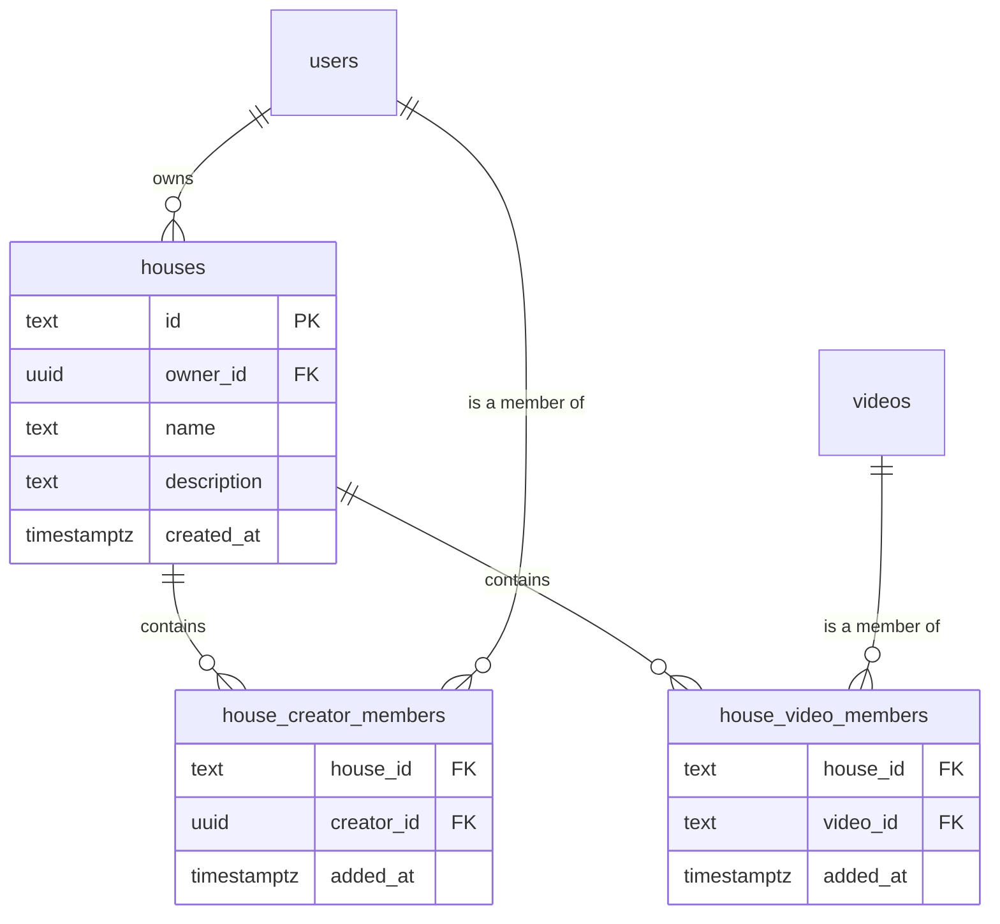

# feat: Houses navigation — department browsing + custom curated houses

## Summary

Adds a new "Houses" nav entry and listing page. A House is a browsable grouping of videos, of two kinds:

- **Built-in Houses** — one per existing department (Cinematography, Editing, etc.). No new membership data: a built-in House's videos are simply every approved video from creators whose `users.department` matches. Derived entirely from data that already exists.
- **Custom Houses** — a new owned entity. Any creator can create one. The owner curates it by adding specific creators (their entire catalog, present and future) and/or specific individual videos. Publicly browsable by anyone; only the owner can edit membership or delete the House.

Selecting either kind of House from the Houses page opens the existing horizontal-swipe feed (`frontend/app/feed/page.tsx`), scoped to that House's videos — no new browsing UI is built.

External research: skipped. This is internal-architecture work (new Postgres tables, FastAPI endpoints, Next.js pages) with strong existing local patterns for every piece (auth dependency injection, junction-table membership via `follows`, typed API client, pure-logic test extraction, nav item shape) and no security/payments/compliance surface or unfamiliar technology layer. No explicit request for external input was made.

---

## Problem Frame

Today, `department` is a free-text label on `users` (set once at creator-upgrade time) that is displayed on creator/video cards but is not a navigable concept — there is no way to browse "everyone in Editing" or to build a personal cross-department collection. This plan makes department a first-class browsing entry point (built-in Houses) and introduces the first user-curated collection primitive in the app (custom Houses), reusing the existing single-card swipe feed as the browsing surface for both rather than building new UI.

## Scope Boundaries

**In scope:**
- New `houses` table (custom Houses only — built-in Houses have no table, they're derived) + two membership junction tables (member creators, member videos).
- New backend endpoints: list all Houses (built-in + custom), get a House's scoped feed, create/delete a custom House, add/remove a creator or video from a custom House's membership.
- New frontend: `/houses` listing page, `/houses/[id]` (a thin route that immediately hands off into the scoped feed — see U4), a manage-members view for a custom House's owner, a new `Houses` nav-bar entry.
- Feed page (`frontend/app/feed/page.tsx`) gains the ability to render a House-scoped feed instead of the default global feed, via a new route param — the existing unscoped `/feed` behavior is untouched.

**Deferred to Follow-Up Work:**
- Editing a custom House's name/description after creation (this plan covers create + delete + membership add/remove only).
- Any notification/badge on the Houses nav item (nav-bar.tsx's badge-dot mechanism is hardcoded to Messages today — generalizing it is out of scope here).
- Per-built-in-House icon/color identity (the built-in Houses list renders with a shared, generic visual treatment in this plan; a bespoke icon-per-department pass is a separate design task).
- Search/filter on the Houses listing page itself (relevant once the number of custom Houses grows past a browsable single page).

**Out of scope (non-goals):**
- Changing what a department *means* for creator upgrade (`frontend/app/profile/page.tsx`'s `DEPARTMENTS` list and the upgrade flow are untouched).
- Collaborative custom Houses (multiple owners/editors) — ownership is single-owner only, matching every other ownership-shaped concept in this app.

---

## Key Technical Decisions

**KTD1 — Built-in Houses have no database table.** A built-in House's identity is just a department name from the existing `frontend/app/profile/page.tsx` `DEPARTMENTS` list; its "membership" is `SELECT ... FROM videos JOIN users WHERE users.department = :name`. Storing a redundant `houses` row per department would require keeping it in sync with `DEPARTMENTS` by hand — a real drift risk for zero benefit, since the department list is already fully described in one place. Only custom Houses get real storage.

**This KTD's premise has a real precondition that this plan must now also close, not just assume.** Flagged during plan review: `users.department` is currently unvalidated free text — `POST /auth/upgrade`'s `UpgradeRequest.department: str` (`backend/app/main.py:47-48`) has no constraint, and `db.upgrade_to_creator` (`db.py:234-244`) writes whatever string arrives straight into the column, with `DEPARTMENTS` enforced only client-side by the `<select>` dropdown. A creator whose stored `department` differs from a `DEPARTMENTS` entry by case, whitespace, or a typo (reachable via any direct API call bypassing the dropdown, not just a hypothetical) becomes silently invisible to their own built-in House forever — `get_department_house_feed`'s exact-string match (U2) simply returns zero rows for them, with no error anywhere in the pipeline to surface the mismatch. This isn't new risk introduced by this plan, but this plan is the first thing that makes the existing gap *consequential*: today an inconsistent `department` value only affects a cosmetic text label; after this plan ships, it silently breaks a creator's discoverability. **U2 must add a validation check to `POST /auth/upgrade`** — reject (400) any `department` value that isn't an exact match to a known `DEPARTMENTS` entry — closing the gap at its actual source rather than working around it downstream. This is a small, additive, low-risk change to an existing endpoint (tightening an unvalidated field, not changing any currently-valid caller's behavior), not a new authorization pattern.

**KTD2 — Custom House membership is two separate junction tables, not one polymorphic table.** Per the confirmed requirement, a custom House can contain both *creators* (their whole catalog, including future uploads — a living subscription) and *specific videos* (individually curated, independent of who made them). These are semantically different relationships (`house → all of creator X's approved videos, forever` vs. `house → exactly this one video`) and conflating them into a single `house_members(member_type, member_id)` table would push type-branching logic into every query that reads membership. Two plain junction tables (`house_creator_members`, `house_video_members`) keep each query a simple join, matching the existing `follows` table's own shape (composite PK, `ON DELETE CASCADE`, no polymorphism).

**KTD2a — Video-level membership is cross-creator by design, matching this KTD's own "independent of who made them" framing; the API enforces no self-catalog restriction, and none is intended.** Flagged during plan review as a real internal tension worth resolving explicitly, not leaving implicit: KTD2's own language already says individually-added videos are curated "independent of who made them," but U5's original UI description ("search the owner's own uploaded-videos list") read as if only self-owned videos could be added, and nothing server-side enforced either reading — so the plan contradicted itself about a load-bearing scope question. Resolved here in KTD2's own favor: `POST /houses/{house_id}/members/videos/{video_id}` accepts any existing, approved/flagged `video_id`, regardless of who created it — a House owner can curate any public video into their House, the same way `follow_user()` lets anyone follow any creator with no consent check (`main.py:223-226`, an existing, unflagged, accepted pattern in this codebase). This is a deliberate product choice, not an oversight: it matches this app's general no-consent-required-for-public-content-curation posture and requires no new authorization logic. U5's manage-members "add a video" search must be updated to match — it searches **all** public videos (reusing the existing global `search()` endpoint's video branch, `db.py:341-347`, exactly as-is, no new backend surface needed), not a self-scoped "my uploads" list that doesn't exist today. See U5's Approach for the corrected UI description.

**KTD3 — A House's feed is a new dedicated endpoint (`GET /houses/{house_id}/feed`), not an extension of `GET /feed`.** Confirmed via research: the existing frontend client `getFeed()` (`frontend/lib/api.ts`) takes zero parameters, and `GET /feed`'s backend contract (`backend/app/main.py`, `backend/app/db.py`) is entirely follows-based (enrouted) + credits-ranked (recommended) with no scoping concept at all. Retrofitting a `house_id` param onto that endpoint would mean branching its two-bucket (enrouted/recommended) query logic around a third, unrelated axis that has nothing to do with follows or credits — a real complexity cost on an endpoint every existing feed consumer already depends on. A separate endpoint keeps `/feed` byte-for-byte untouched and gives the House feed its own simpler, single-bucket response shape (see KTD4). (An earlier version of this rationale also cited the CI regression-baseline gate, `scripts/compare_baseline.py`, as a safety net that would catch a careless retrofit — checked during plan review and removed: that gate compares named test *outcomes* against a JUnit-based baseline, has no awareness of route/response-shape contracts, and there is currently no automated test exercising `GET /feed`'s response shape for it to regress *from*. The decision stands on the branching-complexity argument alone, which doesn't need that claim.)

**KTD4 — A House's feed response is a flat list, not the `{enrouted, recommended}` bucket split.** The enrouted/recommended split exists specifically to distinguish "people you follow" from "everyone else," a distinction that doesn't apply inside a single House (you're not following/not-following a House). The House feed endpoint returns `{videos: Job[]}`, ordered by `created_at DESC` (recency) — matching this app's existing default ordering for "just show me things" views (e.g. `get_creator_profile`'s own video list) rather than inventing a new ranking. The frontend's existing divider-injection logic (`frontend/lib/feedItems.ts`) is reused optionally: a House feed needs at most one section label ("<House name>"), not the Following/Recommended two-divider pattern.

**KTD5 — Ownership checks are introduced fresh, following `_require_creator`'s existing shape.** Research confirmed no resource-ownership check exists anywhere in this codebase today (`_require_creator` is role-based, not resource-based; `follows` needs no ownership check since it's symmetric). This plan adds a `_require_house_owner(house_id, viewer_id)` dependency-style check in `backend/app/main.py`, mirroring `_require_creator`'s decode-then-verify-then-raise-403 shape, used by the create-membership-mutation and delete-House routes.

**KTD6 — Custom Houses are public by default, no private/visibility flag.** Confirmed requirement: any user can browse any custom House on the Houses listing page. The `houses` table has no `is_public` column — adding one now for a state that's always true would be dead schema. If private Houses are wanted later, that's a new column + a follow-up plan, not a flag this plan should half-implement.

**KTD7 — The `/houses/[id]` route is a thin redirect/pass-through into the feed, not a duplicate feed page.** Rather than copy `frontend/app/feed/page.tsx`'s ~700 lines into a second file (which would immediately diverge from every future feed fix, e.g. the swipe-gesture and gradient-seam fixes already shipped this session), `frontend/app/feed/page.tsx` itself gains a `houseId` read from its own query string (`useSearchParams`) and switches its data-fetch call between `getFeed()` and `getHouseFeed(houseId)` at the top of its existing load effect. `/houses/[id]/page.tsx` is a small server/client component that reads the dynamic segment and immediately `router.replace`s to `/feed?house=<id>`. This keeps exactly one feed implementation.

---

## High-Level Technical Design



**Request flow for browsing a House:**

```
Houses page (/houses)
  → GET /houses  (built-in list, derived from DEPARTMENTS, no DB call
                   for names; + real custom houses from the houses table)
  → user taps a House card
  → built-in: navigate to /feed?house=department:Cinematography
     custom:   navigate to /houses/[id] → router.replace to /feed?house=<uuid>
  → feed page reads `house` search param on mount
     - starts with "department:" → GET /houses/department/{name}/feed
     - otherwise                 → GET /houses/{id}/feed
  → existing SwipeCard / ThumbnailStrip / gesture code renders the
    result exactly as it renders the default feed today — no new
    player/gesture code
```

Built-in and custom Houses intentionally use two distinct read endpoints (`GET /houses/department/{name}/feed` vs. `GET /houses/{id}/feed`) rather than forcing built-in Houses into a synthetic row in the `houses` table (see KTD1) — the frontend distinguishes them by a simple string-prefix convention on the `house` query param, not by a shared id space.

---

## Implementation Units

### U1. Backend schema: `houses`, `house_creator_members`, `house_video_members`

**Goal:** Add the three new tables custom Houses need, following this repo's existing idempotent-migration convention exactly.

**Requirements:** Supports KTD1, KTD2, KTD6.

**Dependencies:** None.

**Files:**
- `backend/app/db.py` — add `_CREATE_HOUSES_TABLE`, `_CREATE_HOUSE_CREATOR_MEMBERS_TABLE`, `_CREATE_HOUSE_VIDEO_MEMBERS_TABLE` constants; append their `cur.execute(...)` calls inside `_ensure_schema()`, after the existing `_CREATE_COMMENTS_INDEX` call and before the column-migration `ALTER TABLE` block (matching the existing "core tables in dependency order, then column migrations" structure at `backend/app/db.py:70-84`).
- `docs/architecture.md` — append the new tables to the `### Database` fenced SQL block (lines ~92-141), following the existing inline-comment style per table.

**Approach:**
- `houses(id TEXT PRIMARY KEY, owner_id UUID REFERENCES users(id), name TEXT NOT NULL, description TEXT, created_at TIMESTAMPTZ)` — `id` generated the same way existing job ids are (a UUID string from the caller, matching `create_job`'s pattern, not a DB-generated serial — keeps ID generation consistent with the rest of this codebase). `owner_id` is `UUID`, not `TEXT`: `users.id` is `UUID PRIMARY KEY DEFAULT gen_random_uuid()` (`backend/app/db.py:28`), and every existing FK referencing it (`follows.follower_id`/`following_id`, `comments.user_id`) is correctly typed `UUID` to match. Getting this wrong here would repeat a real, already-present mistake in this codebase: `videos.user_id` was added as `TEXT` via a later `ALTER TABLE` (`db.py:80`) instead of matching `users.id`'s `UUID` type, and every query joining it back to `users` (`get_feed`, `get_creator_profile`, `search`, `add_credit`) has carried an explicit `::uuid` cast workaround ever since (`db.py:164,180,266,312,345`) as a result. Do not introduce a second instance of this.
- `house_creator_members(house_id TEXT REFERENCES houses(id) ON DELETE CASCADE, creator_id UUID REFERENCES users(id) ON DELETE CASCADE, added_at TIMESTAMPTZ, PRIMARY KEY (house_id, creator_id))` — composite PK + cascade delete, mirroring `follows`'s exact shape (`backend/app/db.py:39-46`) including its FK typing: `follows.following_id` (the column this is directly analogous to) is `UUID`, so `creator_id` is `UUID` here too, for the same reason as `houses.owner_id` above.
- `house_video_members(house_id TEXT REFERENCES houses(id) ON DELETE CASCADE, video_id TEXT REFERENCES videos(id) ON DELETE CASCADE, added_at TIMESTAMPTZ, PRIMARY KEY (house_id, video_id))` — `video_id` stays `TEXT`, correctly matching `videos.id`'s real type (`TEXT PRIMARY KEY`, `db.py:12`) — this table needs no `UUID`/`TEXT` correction, only the creator-referencing table above does.
- No `is_public` column (KTD6). No `updated_at` on `houses` (name/description editing is deferred — see Scope Boundaries).

**Patterns to follow:** `_CREATE_FOLLOWS_TABLE` (`backend/app/db.py:39-46`) for both junction tables' shape; `_ensure_schema()`'s existing ordering discipline.

**Test scenarios:**
- Test expectation: none — pure schema/migration, no business logic to unit test (matches this repo's existing precedent: `_ensure_schema()` itself has no dedicated test, per research confirming no DB-mocking pattern exists in this repo's backend test suite).

**Verification:** After deploying, `_ensure_schema()` runs without error against a fresh database and against the existing populated database (idempotency) — confirmed by starting the API locally against the dev Postgres instance and checking `\d houses`, `\d house_creator_members`, `\d house_video_members` in `psql`.

---

### U2. Backend: House listing, ownership check, and CRUD/membership endpoints

**Goal:** The full backend API surface for Houses — list, read a House's feed, create/delete a custom House, add/remove members.

**Requirements:** Supports KTD1, KTD3, KTD4, KTD5.

**Dependencies:** U1.

**Files:**
- `backend/app/db.py` — new query functions: `list_custom_houses()`, `get_house(house_id)`, `create_house(owner_id, name, description)`, `delete_house(house_id)`, `add_house_creator_member(house_id, creator_id)`, `remove_house_creator_member(house_id, creator_id)`, `add_house_video_member(house_id, video_id)`, `remove_house_video_member(house_id, video_id)`, `get_house_feed(house_id)`, `get_department_house_feed(department_name)`.
- `backend/app/main.py` — new routes (see Approach for the exact surface); new `_require_house_owner` dependency; new routes' handlers reuse the existing `_enrich()` transform (see Approach); **existing `POST /auth/upgrade` handler gains a `department` validation check against the canonical `DEPARTMENTS` list** (see KTD1's precondition note above) — the one existing-endpoint change this unit makes, everything else here is additive.
- `frontend/lib/api.ts` — typed client functions for every new endpoint, following the existing per-endpoint function pattern in this file exactly (one exported async function per route, typed request/response).
- `docs/architecture.md` — append the new routes to the existing route-listing prose/table (wherever `GET /feed`, `POST /creators/{id}/follow`, etc. are currently documented).

**Approach:**
- `GET /houses` — returns `{builtIn: {name: string}[], custom: House[]}`. `builtIn` is the hardcoded `DEPARTMENTS` list (duplicated from the frontend constant into a small backend constant, or imported from a shared source if one is introduced — see Open Questions) mapped to `{name}` objects; no DB query needed for this half. `custom` is `list_custom_houses()` — all rows from `houses`, each including `owner_id`, `name`, `description`, and a member count (creators + videos) for display on the listing card.
- `GET /houses/department/{name}/feed` — `get_department_house_feed(name)`: `SELECT videos.*, users.name AS creator_name, users.department AS creator_department FROM videos JOIN users ON videos.user_id::uuid = users.id WHERE users.department = %s AND videos.overall_status IN ('approved','flagged') ORDER BY videos.created_at DESC`. Mirrors the existing `overall_status IN (...)` filter already used in `get_feed()` (`backend/app/db.py:161,177`) so a built-in House shows exactly the same "approved or flagged" visibility rule the main feed uses — not a stricter or looser filter invented fresh. **The `::uuid` cast on the join is required, not optional**: `videos.user_id` is `TEXT` (added via a later `ALTER TABLE`, `db.py:80`) while `users.id` is `UUID` — every existing query in this codebase that performs this exact join (`get_feed`, `get_creator_profile`, `search`, `add_credit`) already carries this same cast (`db.py:164,180,266,312,345`) for exactly this reason. Omitting it here raises `operator does not exist: text = uuid` at query time — confirmed via plan review as a hard runtime failure, not a style choice.
- `GET /houses/{house_id}/feed` — `get_house_feed(house_id)`: a single query over `videos` filtered by `overall_status IN ('approved','flagged') AND (creator is a house_creator_members member OR video is a house_video_members member)`, ordered by `created_at DESC`. A video whose creator is a member AND that was also individually added satisfies both OR-branches but is still selected exactly once, since this is one `SELECT` over one base table (`videos`), not two unioned queries — there's no mechanism for a single-`SELECT`-over-one-table query to return the same primary-key row twice for its OR-branches alone to duplicate. See the Technical design sketch below for the exact shape (now including the same required `::uuid` cast as above); implement it as written there (one `SELECT` with an `OR`'d `WHERE`, not two `SELECT`s combined with `UNION`).
- **Both new route handlers in `main.py` must run their query results through the same `_enrich()` transform `GET /feed`'s handler already applies (`main.py:144-178`)** before returning them — confirmed via plan review as a required step, not an optional polish pass. Raw `db.py` rows are not directly usable by the frontend: `_enrich()` renames `_id` → `job_id` (the frontend `Job` type has no `_id` field — `frontend/lib/api.ts:25-40`), renames `pillar_results` → `pillars`, and converts `file_path` (an `s3://...` URI) into a real playable `video_url` via a live `storage.get_presigned_url()` call — none of which are DB columns; skipping this step means every House-feed video renders with an undefined `job_id` (breaking the frontend's React key, video-ref lookup, and credit/comment call paths) and no `video_url` (every card falls back to "No video available"). Reuse `_enrich()` directly (extract it to a shared helper if its current form is too tightly coupled to `GET /feed`'s specific closure, rather than duplicating its logic) — do not write a second, parallel enrichment implementation.
- `POST /houses` — `Depends(_require_creator)` (only creators can make a House, matching the confirmed requirement; reuses the existing role check exactly, no new role-check code). Body: `{name, description}`. Returns the created `House`.
- `DELETE /houses/{house_id}` — `Depends(_require_house_owner)`.
- `POST /houses/{house_id}/members/creators/{creator_id}` / `DELETE` (same path) — `Depends(_require_house_owner)`.
- `POST /houses/{house_id}/members/videos/{video_id}` / `DELETE` (same path) — `Depends(_require_house_owner)`.
- `_require_house_owner(house_id: str, token: str = Depends(oauth2_scheme)) -> str` — decodes the token (same as `_require_auth`), fetches the house via `db.get_house(house_id)`, raises `404` if it doesn't exist, raises `403` if `house["owner_id"] != viewer_id`, otherwise returns `viewer_id`. This is the first resource-ownership check in this codebase (KTD5) — written as its own named dependency (not inlined per-route) specifically so it's reusable across all four owner-gated routes and testable in isolation.

**Technical design** (directional — not literal SQL):
```
get_house_feed(house_id):
  SELECT v.*, u.name, u.department
  FROM videos v JOIN users u ON v.user_id::uuid = u.id
  WHERE v.overall_status IN ('approved','flagged')
    AND (
      v.user_id::uuid IN (SELECT creator_id FROM house_creator_members WHERE house_id = :id)
      OR
      v.id IN (SELECT video_id FROM house_video_members WHERE house_id = :id)
    )
  ORDER BY v.created_at DESC
```
No `DISTINCT` — a single `SELECT` filtered by an `OR`'d `WHERE` over one base table cannot itself return the same `v.id` row twice no matter how many of the OR-branches a given row satisfies, so there is nothing here for `DISTINCT` to deduplicate; adding it would be a no-op that misleadingly implies real dedup work is happening. Both `v.user_id::uuid` casts are required — `v.user_id` is `TEXT`, both `u.id` and `house_creator_members.creator_id` are `UUID` — matching the cast pattern already used four times elsewhere in `db.py` for this identical join.

**Patterns to follow:** `_require_creator` (`backend/app/main.py:110-122`) for the shape of `_require_house_owner`; `follow_user()`'s `INSERT ... ON CONFLICT DO NOTHING` (`backend/app/db.py`) for `add_house_*_member` idempotency; `unfollow_user()`'s plain `DELETE WHERE` for the remove functions. (Responses in this codebase's backend are plain dicts, not Pydantic models — `get_feed`/`get_creator_profile`/`search` all return untyped dicts; there is no `Job` Pydantic class in `main.py` to pattern-match against, only a TypeScript `Job` type on the frontend. Shape the new `House` response as an untyped dict the same way the rest of this file's responses already are.)

**Test scenarios:**
- Happy path: `POST /houses` as a creator returns a house with the correct owner_id; `GET /houses` includes it in `custom` afterward.
- Happy path: adding a creator to a house, then calling that house's feed, returns that creator's approved videos.
- Happy path: adding an individual video (from a creator NOT otherwise a member) to a house, then calling that house's feed, includes that one video only from that creator.
- Happy path: adding a video whose creator is a DIFFERENT user than the House owner succeeds and the video appears in the feed — confirms KTD2a's cross-creator-by-design behavior is real, not just documented intent. (Explicitly not a 403 case: there is no ownership check on the video's creator, only on the House itself.)
- Edge case: a video that qualifies via BOTH creator-membership and individual video-membership appears exactly once in the feed (dedup check).
- Edge case: a house with zero members returns an empty feed list, not an error.
- Edge case: `GET /houses/department/{name}/feed` for a department with zero creators returns an empty list, not an error.
- Error path: `DELETE /houses/{house_id}` by a non-owner returns 403.
- Error path: adding/removing a member by a non-owner returns 403.
- Error path: any owner-gated route against a nonexistent `house_id` returns 404, not a 500/unhandled DB error.
- Error path: `POST /houses` by a viewer (non-creator) returns 403, matching `_require_creator`'s existing behavior on `POST /videos`.
- Error path: `POST /auth/upgrade` with a `department` value not in `DEPARTMENTS` (case-mismatched, whitespace-padded, or entirely unknown) returns 400, not a silent write of the bad value.
- Happy path: `POST /auth/upgrade` with a valid, exact-match `department` value succeeds exactly as it does today (this is a tightening of an unvalidated field, not a behavior change for any currently-valid caller — confirm no existing valid usage regresses).
- Integration: a blocked/flagged-for-removal video (if a future moderation action changes `overall_status` to `blocked`) stops appearing in any House feed it was a member of, without needing to remove the membership row explicitly — since the feed query filters on `overall_status` at read time, not at membership-write time.

**Verification:** New endpoints exercised via `curl`/an API client against a locally running backend, covering the happy paths and the 403/404 error paths above; `docs/architecture.md`'s route documentation matches the real implemented surface.

---

### U3. Frontend: pure-logic module for House display/sequencing

**Goal:** Extract the non-trivial pure logic this feature needs into a testable `frontend/lib/*.ts` module, matching this repo's established pure-logic-extraction convention (`feedItems.ts`, `gestureClassifier.ts`).

**Requirements:** Supports U4, U5.

**Dependencies:** None (can be built in parallel with U1/U2 against a typed placeholder shape).

**Files:**
- `frontend/lib/houses.ts` (new)
- `frontend/lib/houses.test.ts` (new)

**Approach:**
- `parseHouseParam(raw: string | null): { kind: "department"; name: string } | { kind: "custom"; id: string } | null` — the one piece of real branching logic behind KTD7's `house` query-string convention (`"department:Cinematography"` vs. a plain custom-house id). Kept out of `frontend/app/feed/page.tsx` itself so the parsing rule is unit-testable without a component-render harness, exactly matching `feedItems.ts`'s own stated rationale for existing as a separate file.
- `formatHouseMemberCount(creatorCount: number, videoCount: number): string` — small display-formatting helper for the Houses listing cards ("3 creators · 12 videos", correct singular/plural, omitting a zero half rather than showing "0 creators").

**Patterns to follow:** `frontend/lib/feedItems.ts`'s header comment (why UI-sequencing logic lives in `lib/`, not in `api.ts`, and not inline in the page component).

**Test scenarios:**
- `parseHouseParam`: null input → null. Empty string → null. `"department:Editing"` → `{kind: "department", name: "Editing"}`. A department name containing no special characters round-trips correctly. A bare id (no `"department:"` prefix) → `{kind: "custom", id: <that string>}`.
- `formatHouseMemberCount`: 0 and 0 → a "no members yet" style string, not "0 creators · 0 videos". 1 creator, 0 videos → singular "creator", omits the videos half. 0 creators, 1 video → singular "video", omits the creators half. Multiple of each → plural, both halves shown.

**Verification:** `npx vitest run frontend/lib/houses.test.ts` passes; both functions have zero dependency on DOM/React so they run under this repo's existing Vitest config unchanged.

---

### U4. Frontend: `/houses` listing page + `/houses/[id]` thin redirect + nav entry

**Goal:** The Houses listing page (built-in + custom), the dynamic-route pass-through for custom Houses, and the new nav-bar entry.

**Requirements:** Supports KTD7.

**Dependencies:** U2 (for real data), U3 (for `parseHouseParam`/formatting).

**Files:**
- `frontend/app/houses/page.tsx` (new)
- `frontend/app/houses/[id]/page.tsx` (new)
- `frontend/components/nav-bar.tsx` — add one `NAV_ITEMS` entry.

**Approach:**
- `nav-bar.tsx`: add `{ href: "/houses", label: "Houses", icon: <IconName size={20} /> }` to `NAV_ITEMS` (no `creatorOnly` — visible to all logged-in users). Confirmed via research that the existing active-highlight logic (`pathname === item.href || pathname.startsWith(...)`) and the badge-dot special-case (hardcoded to `item.href === "/messages"`, scoped by an explicit guard) both require no further change for a new plain nav item — this is a genuinely one-line addition plus one new icon import.
- `frontend/app/houses/page.tsx`: on mount, calls the new `listHouses()` client function (U2); renders two sections, "Departments" (built-in, from the `builtIn` list) and "Custom Houses" (from `custom`), each item a tappable card. Tapping a built-in card navigates to `/feed?house=department:<name>`; tapping a custom card navigates to `/feed?house=<id>`. A "Create a House" affordance (visible only to creators, mirroring `Upload`'s `creatorOnly` gating pattern) opens a small create form (name + description) posting to `POST /houses`, then navigating straight to the new House's manage-members view (see below) so the owner can immediately add members — an empty House with no way to populate it would be a dead end.
- `frontend/app/houses/[id]/page.tsx`: reads the dynamic `id` segment; if the current user is the House's owner (compare against `getUser()?.id`, same pattern `profile/page.tsx` already uses), renders the manage-members view inline (add/remove creators and videos — see U5's UI shape) with a "View feed" link that does the `router.replace("/feed?house=" + id)` handoff; if the viewer is not the owner, `router.replace`s straight to the feed immediately (KTD7) with no intermediate screen.

**Patterns to follow:** `frontend/app/creators/[id]/page.tsx` as the dynamic-route template (the only existing `[id]` precedent in this app); `frontend/app/search/page.tsx`'s card-list rendering for the Houses listing's visual shape; `Upload`'s `creatorOnly: true` for the "Create a House" gating.

**Test scenarios:**
- Test expectation: none for the page components themselves — this repo has no component-render test harness (confirmed via research: no `@testing-library/react`, no `.tsx` entries in `vitest.config.ts`'s include glob). Behavioral coverage for this unit is the manual/real-browser verification below, matching this session's established practice for UI that isn't covered by the pure-logic-only Vitest suite.

**Verification:** Manual + real-browser check (this repo's established non-automatable-UI verification method this session): `/houses` lists all departments and any existing custom Houses; tapping a department card lands on the feed showing only that department's videos; tapping a custom House card lands on the feed showing only that House's videos; the owner of a custom House sees a manage view when visiting `/houses/[id]`, a non-owner is redirected straight past it; the nav bar's Houses icon highlights correctly on both `/houses` and `/houses/[id]`.

---

### U5. Frontend: House-scoped feed + manage-members UI

**Goal:** Wire the existing feed page to render a House-scoped result, and build the add/remove-member interaction for a custom House's owner.

**Requirements:** Supports KTD3, KTD4, KTD7.

**Dependencies:** U2, U3, U4.

**Files:**
- `frontend/app/feed/page.tsx` — the load effect gains a `house` search-param branch.
- `frontend/app/houses/[id]/page.tsx` — the manage-members section (creator search-and-add, video search-and-add, remove-per-row), building on U4's skeleton.
- `frontend/lib/api.ts` — already covered by U2's client-function additions; this unit is purely the UI consuming them.

**Approach:**
- **Required structural change, not just a new effect branch — `useSearchParams()` needs a `<Suspense>` boundary.** This app has an exact existing precedent for this: `frontend/app/messages/compose/page.tsx` (lines ~54-63) already establishes that Next.js's App Router requires any component calling `useSearchParams()` to be wrapped in `<Suspense>`, structured there as a thin default-export shell (`<Suspense fallback={null}><ComposePageInner /></Suspense>`) with the real logic moved into a separate inner component. `frontend/app/feed/page.tsx` today is one large `"use client"` default-export function containing all of its hooks and JSX directly (confirmed: no existing `useSearchParams` usage anywhere in this file). Adding the `house`-param read means restructuring `FeedPage` the same way `compose/page.tsx` already does — a default export that is just `<Suspense fallback={null}><FeedPageInner /></Suspense>`, with today's entire component body renamed to `FeedPageInner` and unchanged otherwise. This is mechanical (a rename + one wrapping component) but is a real, required step this unit must include, not an optional nicety — omitting it causes a build/prerender failure, per the Next.js version pinned in this app (`frontend/package.json`, Next 16.2.9).
- Inside `FeedPageInner`'s existing mount effect (`getFeed().then(...)`), branch at the top: read `house` via `useSearchParams()`, run it through `parseHouseParam` (U3); if non-null, call `getHouseFeed(id)` or `getDepartmentHouseFeed(name)` instead of `getFeed()`, and build `items` from the flat `{videos: Job[]}` result with at most one divider (the House's own name/the department name as the section label — reusing `SectionDivider`'s existing shape from `feedItems.ts`, KTD4) instead of the Following/Recommended two-divider pattern. The existing `feed` state (`useState<FeedResponse>(...)`, currently seeded from `getFeed()`'s `{enrouted, recommended}` shape) is write-only today — nothing in the file reads it back after the initial `setFeed(data)` call — so the House-scoped branch can safely leave it at its default/unset value rather than trying to synthesize a fake `FeedResponse` shape for a response that isn't bucketed that way; confirm this remains true (no new reader of `feed` was introduced) before relying on it. Every other piece of the feed page — `SwipeCard`, gesture handling, `ThumbnailStrip`, the action-button column, the gradient fix, `goNext`/`goPrev`, the per-job-id `credited`/`creditCounts`/`saved`/`following` maps — is untouched, since they all operate on the same `items`/`current` state regardless of how `items` was populated (verified line-by-line against the real file; no hidden coupling to bucket origin found).
- **Known, harmless side effect worth a deliberate test scenario, not a surprise:** because a House-scoped `items` array always starts with its one section-label divider at index 0, and `current` initializes to `0`, the existing divider-auto-skip (`setTimeout(() => goNext(), 600)`, fires whenever `current` points at a divider) now fires unconditionally on every single House-feed page load — previously a rare edge path, this becomes the House feed's universal ~600ms entry behavior (a brief flash of the section label alone before the first video settles in). This does not break anything (the card/counter/hint-arrow logic all fall back correctly to `videoItems[0]` during that window, confirmed including the single-video case), but it's a real, newly-guaranteed piece of UX this plan should own rather than let a reader discover by surprise — see the test scenario below.
- Manage-members UI (owner-only, inside `/houses/[id]/page.tsx`): two sections, "Creators" and "Videos," each following the `settings/privacy` page's confirmed real pattern (per-row pending-id during remove, filter-from-state-on-success, inline error banner, empty-state-via-conditional-subtitle) — but wired to this feature's own new `frontend/lib/api.ts` functions and real `backend/app/db.py` tables, not to `gatekept-api.ts` (the research finding that page's data layer belongs to an unrelated sub-product and is not reusable here). Adding a member: a lightweight search-as-you-type against the existing `search()` endpoint — both branches, creators and videos, exactly as that endpoint exists today, with no new "my uploads only" scoping (per KTD2a: video-membership is intentionally cross-creator, so the video-add search is the same global search a viewer would use on `/search`, not a filtered subset). Tapping a result calls the add-member endpoint and appends it to the local member list optimistically-after-success (matching the confirmed pattern exactly, not a different optimistic-before-success approach).

**Patterns to follow:** `frontend/app/settings/privacy/page.tsx`'s full structural shape (auth guard → fetch-in-effect → per-row pending-id remove → filter-from-state-on-success → empty/loading/error via simple conditionals, inline-styled with this repo's CSS variables) — confirmed via research as real, battle-tested precedent for exactly this "list with add/remove, owned by the current user" shape, reused here for its UI pattern only, not its data layer. `frontend/app/search/page.tsx`'s debounced search-as-you-type for the add-creator search box.

**Test scenarios:**
- Happy path: visiting `/feed?house=department:Editing` renders only Editing-department videos, in recency order, with a single "Editing" section label instead of Following/Recommended.
- Happy path: visiting `/feed?house=<custom-id>` renders that House's unioned creator+video membership.
- Happy path (owner): adding a creator via the manage view immediately shows them in the "Creators" list; visiting the House's feed afterward includes their videos.
- Happy path (owner): removing a creator or video immediately removes it from the manage list; the House's feed no longer includes it.
- Edge case: visiting `/feed` with no `house` param at all behaves byte-for-byte identically to today (KTD3's "untouched" guarantee) — the existing default-feed test coverage (none currently exists as automated tests, per research, but this must hold under manual verification) is the regression to guard against.
- Edge case: a House with zero members renders an empty state, not a crash — reusing `feed/page.tsx`'s existing empty-state layout (already present for the zero-video case) but **not its literal copy**. Flagged during plan review: the default copy ("No videos yet. / Upload filmmaking content to get started.") was written for the unscoped global feed, where "upload to get started" is universally actionable — reused verbatim on a House-scoped empty state, it misleads two of three visitor types, since uploading doesn't populate any specific House (built-in House membership is derived from `department`, unrelated to uploading; custom House membership is curated only by its owner, unrelated to the visitor uploading anything). The House-scoped empty state needs its own two copy variants: a **non-owner visitor** (any built-in House, or someone else's custom House) sees copy that doesn't imply uploading helps (e.g. "No videos in this House yet."); the **custom House's own owner** sees copy pointing at the manage-members view instead (e.g. "No members yet — add creators or videos to get started," linking to `/houses/[id]`'s manage view). Determine owner-vs-visitor the same way U4 already does (`getUser()?.id` compared against the House's `owner_id`).
- Edge case: a House-scoped feed visit shows the expected ~600ms section-label-only flash before settling on the first video (the divider-auto-skip becoming unconditional on this path, per the Approach note above) — confirm this resolves cleanly to `videoIdx 1/N` and does not leave the view stuck on the divider or produce a visible glitch, including for a House with exactly one video.
- Error path: `getHouseFeed`/`getDepartmentHouseFeed` failing (network/404) surfaces the same inline error state the default feed already shows on a fetch failure, not an unhandled exception.
- Error path (owner UI): add/remove-member failure shows the inline error banner and does not silently drop the row from the UI without feedback.

**Verification:** Real-browser check (Playwright, temporary install + removal, matching this session's established verification method for gesture/visual feed behavior) confirming: a department-scoped feed shows the right subset of a stubbed feed response; a custom-House-scoped feed correctly unions creator- and video-level membership with no duplicates; the default unscoped `/feed` is visually and functionally identical before/after this change (including that the new `<Suspense>` wrapper introduces no visible fallback flash on the default, no-`house`-param path); the manage-members add/remove flow updates both the local list and (on a subsequent feed visit) the actual feed contents.

---

## Documentation Impact

Per CLAUDE.md's Area 7 Documentation Update Rule, this change touches system design and the DB schema, so all of the following are required, not optional:
- `docs/changelog.md` — new dated entry covering the schema addition, the new endpoints, and the new pages, at the same level of detail this session's other feature entries use.
- `docs/project_status.md` — new milestone section, matching the existing per-feature checklist format.
- `docs/architecture.md` — the new tables appended to the `### Database` SQL block; the new routes documented alongside the existing route list; the `### Frontend > Pages` table gains `/houses` and `/houses/[id]` rows; a short note in `## Feed Algorithm` pointing at the House-scoped variant's divergence from the enrouted/recommended shape (KTD4).
- `README.md` — the Pages table (if it independently lists routes, per this session's own precedent of keeping both files' route tables in sync) gains the same two rows.

---

## Risks & Dependencies

- **First-ever resource-ownership check in this codebase (KTD5).** Getting `_require_house_owner` wrong (e.g. checking existence but not ownership, or vice versa) is the single highest-value thing to test carefully in U2 — there's no existing test or pattern to lean on if it's subtly wrong. (The dependency-injection wiring itself — a `Depends(...)` function taking a path parameter alongside the token — was verified against this app's exact pinned FastAPI version during plan review and confirmed to work as described; the remaining risk is business-logic correctness, not framework wiring.)
- **FK type correctness on the new tables (U1).** `houses.owner_id` and `house_creator_members.creator_id` must be `UUID`, matching `users.id`'s real type — not `TEXT`. This codebase already carries one accidental instance of exactly this mistake (`videos.user_id`, requiring an explicit `::uuid` cast at every join site ever since); shipping a second one on brand-new tables would be avoidable, self-inflicted debt. Double-check this specific detail in review before merging U1.
- **Required `<Suspense>` restructuring of `frontend/app/feed/page.tsx` (U5).** `useSearchParams()` requires a `<Suspense>` boundary in this app's Next.js version — confirmed via this app's own existing precedent, `frontend/app/messages/compose/page.tsx`. Skipping this causes a build/prerender failure, not a lint warning; treat it as a required step of U5, not an optional cleanup.
- **Scope-param regression risk on the default feed (U5).** `frontend/app/feed/page.tsx` is a large, already-iterated-on file (this session alone shipped 6+ PRs against it). The `house`-param branch, and the `<Suspense>` restructuring above, must both be done so the zero-param path is provably unchanged — the plan's explicit "byte-for-byte identical" edge-case test scenario (including no visible `<Suspense>` fallback flash on that path) exists specifically to catch a careless refactor here.
- **`_enrich()` reuse is required, not optional, on both new feed routes (U2).** Without it, House-feed videos have no `job_id` and no signed `video_url` — every card silently renders as "No video available." Flagged during plan review as a full-feature-breaking gap that a `curl`-based check could easily miss (the raw response still looks like plausible JSON) and that would likely only surface during U5's real-browser verification pass, later than ideal — worth a specific, deliberate check at the end of U2 rather than assuming it'll be caught downstream.
- **Membership rows have no `overall_status` gate at write time, only at feed-read time (U2) — confirmed intentional, not a gap.** A House owner can add a not-yet-approved video/creator as a member; it simply won't render until (if ever) it's approved, per the feed query's existing `overall_status` filter. Noted here only so this is a documented, conscious choice rather than an implicit one.

## Open Questions

- Where should the canonical `DEPARTMENTS` list live once both the frontend (`frontend/app/profile/page.tsx`) and backend (U2's `GET /houses` AND, now, `POST /auth/upgrade`'s new validation check) need it? This plan defaults to duplicating the list into a small backend constant (matching the fact that nothing in this codebase currently shares constants across the frontend/backend boundary). **Updated during plan review**: this is no longer purely a "which copy is canonical for display purposes" question — `POST /auth/upgrade`'s new validation check (added to close the KTD1 premise gap above) makes the backend's copy load-bearing for data integrity, not just cosmetic, the moment it exists. The two-copies-with-manual-sync default is still fine to ship with (both lists are short, human-maintained, and change rarely), but if they ever drift, the failure mode is now "a real department gets rejected by validation," not just "a display label looks slightly off" — worth re-weighing the shared-source alternative sooner than "deferrable" originally implied, though still not blocking this plan.
- Exact icon choice for the Houses nav entry (`lucide-react` has several plausible options — `Building2`, `LayoutGrid`, `Layers`) — left to implementation-time taste, not a decision worth blocking planning on.
- Concurrent membership-write vs. House-deletion race (flagged during plan review, confidence 50/advisory): `DELETE /houses/{house_id}` and a `POST .../members/...` call from the legitimate owner could theoretically race (e.g. a slow-connection double-action), with the insert either succeeding into a row about to cascade away (harmless) or hitting an FK violation not currently enumerated as a distinct error path. Genuinely low-likelihood for a solo-owner-gated action on a small app; not worth a dedicated test scenario at plan time, but worth a mental note if this class of bug ever surfaces in practice.
- A `house_creator_members` row currently has no mechanism tied to whether that creator's `account_type`/department later changes (flagged during plan review, confidence 50/advisory) — confirmed not reachable today since no account-downgrade or deletion flow exists anywhere in this codebase. Purely latent; revisit only if such a flow is ever added.
